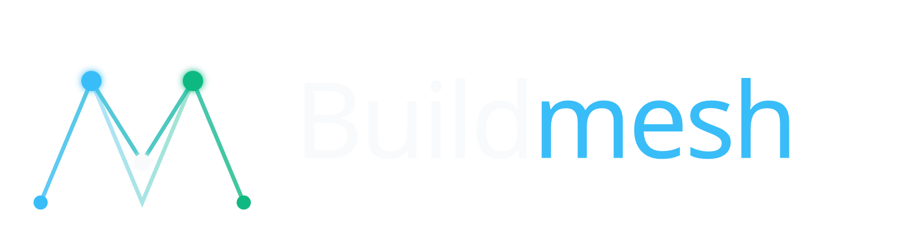

# Buildmesh



Buildmesh is a Tauri desktop app for orchestrating multiple AI coding agents — **Anthropic (Claude Code), Minimax, Kimi, OpenCode, Antigravity, and Codex** — across multiple meshes at the same time. It runs each agent as a durable process in a persistent xterm.js terminal, isolates work via Git worktrees, and exposes a tiled grid view so you can watch all of them at once.

If you use Claude Code / Antigravity / OpenCode from your shell and find yourself `tmux`-ing, copy-pasting between tabs, or losing context when a long-running agent restarts — Buildmesh is what that should look like.

## Features

### Multi-agent orchestration
- **Six providers, one workflow**: Anthropic (Claude Code), Minimax, Kimi, OpenCode, Antigravity, and Codex. Switch providers per agent node.
- **Multi-mesh workspaces**: open several meshes side by side. Each mesh is its own grid of agent terminals.
- **Tiled grid view**: split each mesh into a 1–6 pane grid. Layouts are saved per mesh.
- **Persistent terminals**: agents run as background processes. Switching meshes, panes, or even quitting the app never interrupts a running agent — `TerminalManager` is a singleton, terminals survive React remounts.
- **Git worktree isolation**: every agent node gets its own worktree branch, so concurrent agents on the same repo never collide.

### Productivity
- **Attention hook**: agents raise a notification when they need your input. Buildmesh listens for `idle_prompt` events on the Claude Code side and surfaces a "needs input" badge in the sidebar — no polling, no timers.
- **Auto-named nodes**: agent nodes are auto-named from their first turn (LLM-generated slug) so a 10-agent swarm stays readable.
- **Session resume**: surviving processes and stored `cli_session_id`s mean a restart resumes where you left off. Crash recovery marks `Running` nodes as `Suspended` on startup.
- **Build & run**: per-mesh build/run commands with auto-detection for Rust, Node, Tauri, JVM, Go, and Python projects.

### Visibility & review
- **File explorer with inline diff**: per-mesh and per-node file trees with line-addition/deletion counts and a side-by-side diff viewer.
- **Changed Files panel**: aggregated view of modified files across the whole mesh.
- **Mesh-level PR creation**: uncommitted-changes indicator + `gh pr create` from Mesh Properties.
- **GitHub Issues integration**: triage, view, and spawn an agent on an issue without leaving the app.
- **Accounts & Usage panel**: per-provider quota tracking for the providers that expose a usage endpoint.

### Power features
- **Remote access**: expose the mesh over the local network via a root token. WebSocket PTY relay streams any terminal to a phone or another machine. Port fallback (1992→1993→1994) means a port conflict never blocks a session.
- **AI context portability**: share `CLAUDE.md`, `.claude/skills`, and friends with Codex, OpenCode, and Antigravity via `AGENTS.md` + `.agents/skills` git symlinks — no per-provider duplication.
- **Dev / Stable side-by-side profiles**: run an in-development build (`buildmesh-dev`) without interrupting the stable hub you orchestrate agents from.

## Agent sandboxing (security)

A prompt-injected or runaway agent runs real shell commands on your machine. Each
**Mesh** has an opt-in **Sandbox** toggle (off by default) that confines every
agent node spawned from it to its own Git worktree, using the host OS's native
confinement — **Seatbelt** on macOS, a **restricted token** on Windows. The toggle
is read at spawn time, so flipping it never disturbs already-running agents, and on
a host with no backend it's a safe no-op.

### What it protects against

| Capability | macOS (Seatbelt, #497) | Windows (restricted token, #528) |
|---|---|---|
| Agent can spawn child processes (`bash`, `git`, `ripgrep`, hooks) | ✅ | ✅ |
| Agent reaches the network (Anthropic API, `git push`) | ✅ | ✅ |
| Agent reaches the hub on loopback (attention hook → `127.0.0.1`) | ✅ | ✅ (fixed in #533) |
| **Writes** confined to the worktree (rest of disk read-only/denied) | ✅ | ⏳ not yet — see #542 |
| **Reads** of home credentials (`~/.ssh`, `~/.aws`, registry) denied | ✅ | ⏳ not yet — see #542 |

The Windows backend was pivoted off a per-node AppContainer ([ADR-0014](docs/adr/0014-pivot-windows-sandbox-off-appcontainer.md)): the AppContainer's private object namespace hung `claude.exe` at libuv's named-pipe creation (#528) and blocked loopback (#533). The restricted token fixes both. Deny-by-default **read/write confinement** on Windows is deferred to **#542** — a same-user restricted token can't deny home reads while MSYS `bash` runs (both are secured by the same user SID), so the surviving path is a separate low-privilege user principal (or WSL). Until then the Windows sandbox fixes the hang and loopback but does **not** yet restrict file access.

### What it is *not*

- **Not a container or VM.** It's an OS access-control boundary on a single process tree, not virtualization or namespacing.
- **Not network egress control.** A sandboxed agent still reaches the internet (it has to, for the model API) — the sandbox limits *filesystem and host* access, not where data can be sent.
- **Not a guarantee the agent binary is trustworthy.** It confines what the agent process can touch; it doesn't vet the agent or its dependencies.

## Keyboard shortcuts

- `Alt + 1–9` — switch to agent node N
- `Alt + G` — toggle grid / single view
- `Ctrl + Alt + D` — toggle debug overlay

## Tech stack

- **Frontend** — React 19, Zustand 5, xterm.js 6, Tailwind 4, TypeScript ~5.8, Vite 7
- **Backend** — Tauri 2, Rust, `portable-pty`, `rusqlite` (SQLite), `git2`
- **Persistence** — local SQLite (`app_settings`, `meshes`, `agent_nodes`)
- **Runtime** — Windows 10/11, with optional WSL2 support
- **Testing** — Vitest (unit + integration) + Playwright (e2e)

## Prerequisites

- **Node.js 20+ (LTS)** and **npm**
- **Rust stable** (1.74+, the minimum Tauri 2 supports)
- **Platform deps** — see [Tauri 2 prerequisites](https://tauri.app/start/prerequisites/) for your OS
  - Windows: WebView2 runtime (preinstalled on Win 11), Microsoft C++ Build Tools
  - macOS: Xcode Command Line Tools
  - Linux: `webkit2gtk`, `libssl-dev`, `libgtk-3-dev`, `libayatana-appindicator3-dev`, `librsvg2-dev`
- **Git CLI** — used for worktree ops, branch handling, and the optional GitHub Issues / PR features
- **(Optional) WSL2** — required only if you want the hybrid Windows/WSL runtime
- **(Optional) `gh` CLI** — only if you want the GitHub Issues and PR features authenticated

## Install

```bash
npm install
```

## Develop

```bash
npm run tauri dev
```

This launches the Tauri shell + Vite dev server. First run takes a few minutes while the Rust backend compiles.

## Build a release binary

```bash
# Stable profile (com.alond.buildmesh, port 1991)
npm run tauri build

# Dev profile (com.alond.buildmesh.dev, port 2991) — runs side-by-side with stable
npm run tauri:build:dev
```

Binaries land in `src-tauri/target/release/`:

| Profile | Binary | Port |
|---|---|---|
| Stable | `buildmesh.exe` | 1991 (HTTP fallback 1992→1993→1994) |
| Dev | `buildmesh-dev.exe` | 2991 (HTTP fallback 2992→2993→2994) |

The dev profile is what `/use` and `/verify` use — it never touches the stable hub.

## Test

```bash
npm test                 # unit + integration
npm run test:e2e         # Playwright e2e (requires the app running on :1991)
npm run test:ci          # all three in one go
cargo test               # Rust unit tests (run inside src-tauri/)
```

## Project structure

```
buildmesh/
├── src/                       # React frontend
│   ├── components/            # Terminal, Sidebar, FileTree, Probe, …
│   ├── stores/                # Zustand stores
│   └── lib/                   # shared utilities
├── src-tauri/
│   ├── src/
│   │   ├── commands/          # Tauri command handlers (#[command])
│   │   ├── agent/             # spawn logic + provider adapters
│   │   │   └── provider/adapters/   # one file per provider (anthropic, minimax, kimi, …)
│   │   ├── db/                # SQLite schema + migrations
│   │   ├── env/               # Windows/WSL path translation
│   │   ├── http/              # attention webhook + remote-access routes
│   │   └── session_naming.rs  # PTY-side session-id capture + LLM rename
│   ├── tauri.conf.json        # stable profile config
│   └── tauri.dev.conf.json    # dev-profile overlay (identifier *.dev, port +1000)
├── tests/
│   ├── unit/                  # Vitest unit tests
│   ├── integration/           # Vitest integration tests
│   └── e2e/                   # Playwright e2e tests
├── docs/
│   ├── knowledge-primer.md    # architecture, conventions, anti-patterns (read first)
│   ├── adr/                   # Architecture Decision Records
│   └── specs/                 # feature specs
├── CONTEXT.md                 # domain language (read alongside knowledge-primer.md)
├── AGENTS.md                  # portable AI-context for non-Claude agents
└── CLAUDE.md                  # AI-agent rules (token-efficient, do not bloat)
```

## Documentation

- **[`docs/knowledge-primer.md`](docs/knowledge-primer.md)** — architecture, conventions, anti-patterns. Read this before touching backend, terminal, agent-spawn, or path code.
- **[`CONTEXT.md`](CONTEXT.md)** — domain language and mental model (what a "Mesh" is, what an "Agent Node" is, how they relate).
- **[`docs/adr/`](docs/adr/)** — Architecture Decision Records.
- **[`docs/specs/`](docs/specs/)** — feature specs and PRDs.
- **[`CLAUDE.md`](CLAUDE.md)** — AI-agent rules (token-efficient; not a human onboarding doc).

## Contributing

1. **File an issue first** — describe the problem, not just the fix. See [the triage process](docs/agents/triage-labels.md) for the labels used.
2. **Match existing patterns** — the codebase has a strong opinionated style. Read `docs/knowledge-primer.md` before opening a PR that touches the backend.
3. **Add or update tests** for any behaviour change. Unit tests live in `tests/unit`, integration in `tests/integration`, e2e in `tests/e2e`.
4. **Verify before pushing** — run `npm run test:ci` and the `/verify` skill. The build must stay green.

## License

Private / not yet published.
