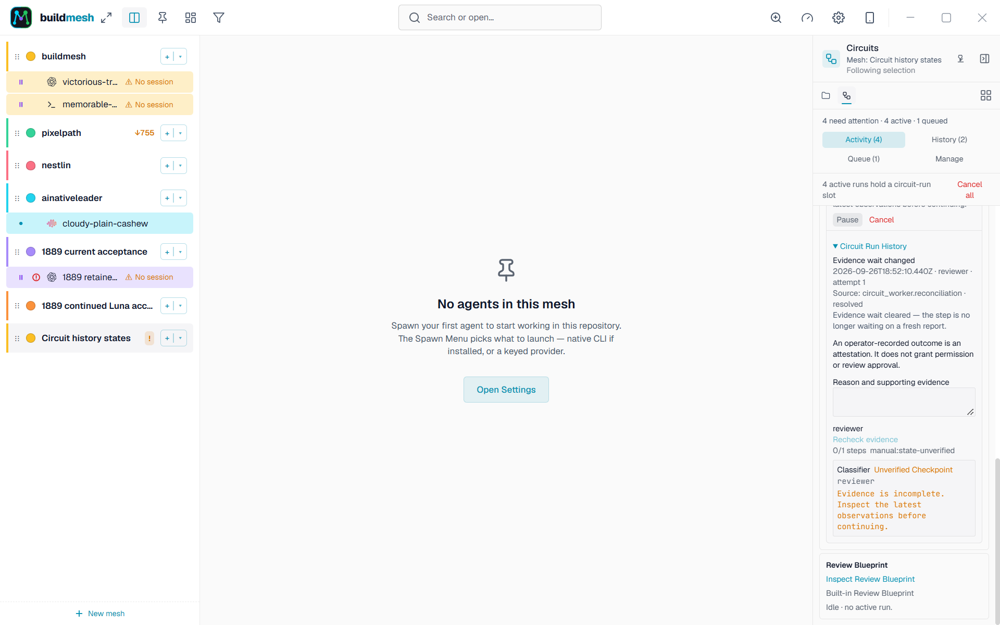
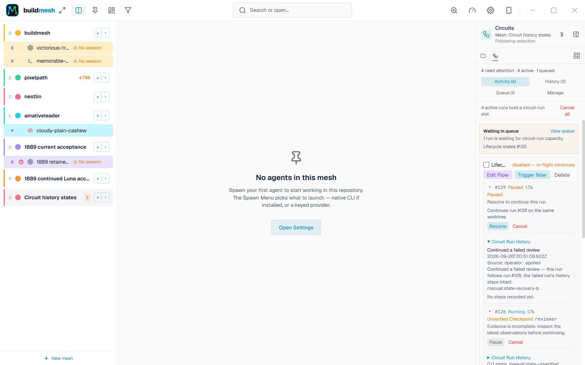
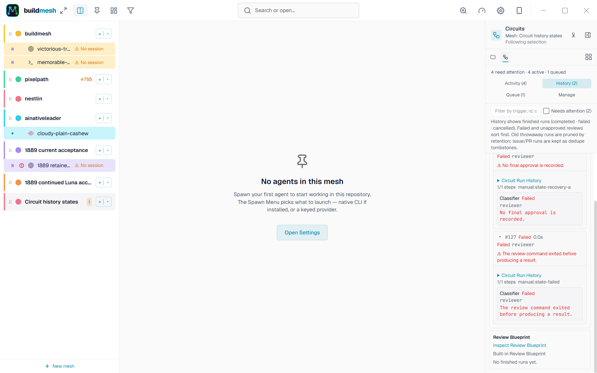
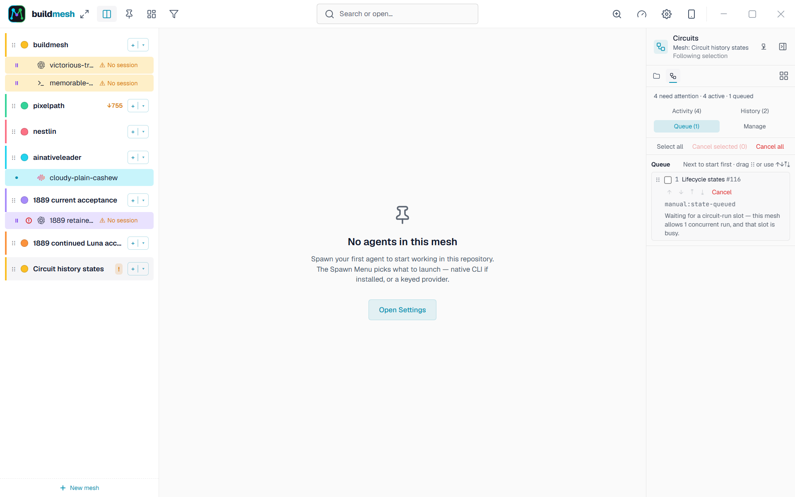
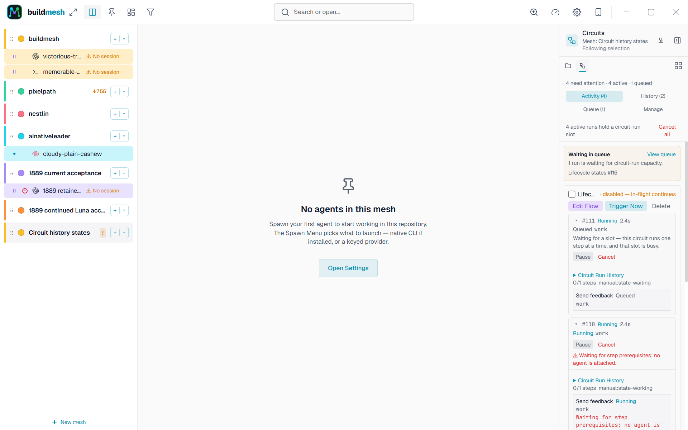

# Circuit reliability acceptance

This records the strict native-proof acceptance work before the September 26
recovery change. The current guarded report-based progress policy and the queue
stall evidence are documented in [the failure investigation](circuit-failures-2026-09-26.md).
The live checks below remain historical evidence, not verification of that change.

Implementation evidence for [#1889](https://github.com/alondero/buildmesh/issues/1889), governed by [#1850](https://github.com/alondero/buildmesh/issues/1850). This is a working acceptance record, not a claim that the specification is implemented. Baseline: `d8e3a1a780599cbdcece4710df2b603860065e7a`.

Source inspection, deterministic automated checks, and live delivery are separate evidence tiers. No aggregate reliability percentage is asserted. Unless recorded otherwise below, platform evidence is Windows, development configuration; harness versions and live delivery are recorded per scenario.

| Scenario / stories | Contract and invariant | Owning seam / automated layer | Evidence and result | Remaining gap |
| --- | --- | --- | --- | --- |
| Lost/delayed hooks, missing optional tokens, stale/late observations (1-8, 14) | #1845: identity fences, stable deduplication, bounded reconciliation | `observation`, native receipts, Codex observer; pure and private DB tests | Windows deterministic tests pass; native request receipt/commit/reopen and delayed start/stop regressions exercised. Codex foreground pull, request callbacks, missing-hook bounded recovery and stale-turn rejection are recorded below | A missing Stop reaches actionable Unverified after the evidence window; rollout-based completion reconciliation remains unverified. Authoritative permission resolution and Claude production submission correlation are unavailable; other harness strategies remain explicitly unsupported |
| Child/background work (9, 11-13) | #1844: foreground termination and all owned work must be terminal | `WorkEvidence`, atomic observation batches; pure tests | Windows scripted ownership tests pass, including late child termination and missing registry entries | No available live harness establishes complete owned-work coverage. Codex live result stays Unverified |
| Human waits (10, 15, 21) | #1846: human waits do not expire or grant authorization | Typed wait observations, stepper, history UI | Windows regression reproduced generic Working incorrectly clearing permission; typed identity/request matching and UI tests added | Claude/Codex exact-request callbacks are wired; uncorrelated waits remain open with an explicit limitation. Live question correlation passed below; permission resolution and human-input-only progression gating remain Unverified |
| Restart and cancellation (22-23) | #1846: terminal cancellation and identity-proven reattachment | Ledger, worker restart, process registry; serial Rust tests | Windows tests pass for cancelled-run fences, ambiguous spawn recovery, receipt reopen, and process generations. Current rebuilt app cancellation left Codex run 45 terminal at attempt one with history retained | Actual app restart resumed the saved Codex session and retained evidence (below); the pending question was interrupted rather than restored, so full reattachment acceptance remains Unverified |
| Unknown effects and recovery races (16-21) | #1846: uncertainty never authorizes replay | Stepper, transactional journal, worker dispatch; serial Rust tests | GitHub, prompt, spawn, continuation, local status, close, and notification recovery policies are inventoried in [the effect recovery contract](circuit-effect-recovery.md). SetNodeStatus now commits with its step; review continuation rollback, reopen deduplication, and publication exclusion have focused DB coverage | Live process crashes and live GitHub mutations remain unverified. Non-OpenPr GitHub actions have no automated read-only recheck and require operator outcome records |
| Operator history and outcomes (24-28) | #1847: append-only causal trace and actionable uncertainty | Ledger, IPC, rendered Probe; Rust and Vitest/live IPC | Typed observation/classification provenance, effect history, scrubbed complete/partial/unavailable reports, operator reasons and capabilities exercised. Wait, capacity/admission, configuration-revision and recovery entries carry source/disposition/identity/time (schema v45) with `resolved` on a cleared wait; reopen tests prove the history (including recovery) survives restart and agrees with the run/step projection; mock-mode and real WebView2 240px runs render every state (working / waiting / Unverified / failed / recovery) with its next safe action. Current rebuilt WebView2 shows Codex's ownership limitation and same-attempt Recheck | Live delivery of hook-driven transitions per harness stays covered by the rows above; this row's history/operator-surface closure is recorded below |
| Review snapshots/continuation (29-32) | #1848: frozen graph/configuration and successor deduplication | Review ledger, launch capture, blueprint UI; Rust/Vitest/live IPC | Frozen effective launch configuration and graph tests pass. Live blueprint copy was disabled/manual/independent; original mutation rejected. Current-build live copy, disable, concurrent continuation, lineage and cancellation checks pass; the continuation link is now durable in the run's own history | The live reviewer dispatch is Unverified: the borrowed-source gate parks Unverified on this harness (see the #1910 section). A run on a copied Review Blueprint offers no Continue review control, so continuation of a *first* review on a copy has no UI entry point. Blueprint mutation refusal is deterministic-only (the read-only surface has no control to click) |
| Legacy retirement/capacity (33-36) | #1849: retained history, no conversion/restart, separate capacity | Startup retirement, spawn/borrow claims, generation-fenced teardown, retained-settings UI | Windows deterministic cutover/reopen tests pass; no Circuit conversion or capacity transfer. Current source build passed real dev IPC, retained-node, 240px, and reload checks. A forced process kill at each durable cleanup boundary is now covered end to end (issue #1911): crash before/inside the intent, after the intent, between the owned-process kill and its acknowledgement, and after the acknowledgement, each followed by a relaunch that retries cleanup | A real agent session is not what the crash phases run against — the contained processes are real PTY-backed fixture children in kill-on-close jobs, and the two in-transaction boundaries are forced with a statement abort rather than a kill inside the commit. The suite is Windows-only: the process claims depend on Win32 job containment, so Linux and macOS run the #1889 retirement checks but not these scenarios (see the #1911 section) |
| Classification (38-40) | #1850: exact fresh report interpretation cannot prove lifecycle | Immutable report envelope and pure classifier gate | Windows regression suites pass for wrong session/attempt/report/input, delayed children and invalidated evidence. Complete report retained separately from interpretation. Every wired report adapter now has identity-bound valid/malformed/partial/unavailable cases (#1912, below) | Optional synthetic fast-model comparison deferred ([#1888](https://github.com/alondero/buildmesh/issues/1888)) |


Every supported observation strategy needs recorded capabilities, source, freshness bounds, child/background coverage, degraded cases, harness version, platform and launch/trust configuration. Fixture parsing alone cannot establish live delivery. Unsupported or untested combinations remain unverified.

## Continued acceptance: 2026-09-26: Review Blueprint copy, deletion and continuation

Work for [#1910](https://github.com/alondero/buildmesh/issues/1910). This section
closes the two items the row above left open — the current-build continuation
check and the blueprint availability/deletion audit — and records one addition:
a continued review's Circuit Run History now names the run it follows, so an
operator can read the relationship there without opening run context.

That entry is an audit record, not a lookup path. The successor dedupe reads
`recovery.from_run_id` from the run's own context
(`db::circuit::recovery::continuation_target_inner`), and a retention sweep
deletes a run together with its history rows. What keeps a lineage resolvable
past the sweep is that a continuation's identity is `manual:%` — a family the
sweep deletes rather than compacts, so the lineage key is never emptied — and
that `SWEEPABLE_RUNS` excludes any run a surviving run still names. That second
half is the fix for [#1924](https://github.com/alondero/buildmesh/issues/1924):
consecutive generations of one frozen review scope share a single recovery
Circuit, so without the guard the sweep's newest-per-circuit allow-list would
delete an intermediate generation and re-continuing the root would walk past the
gap and mint a sibling. `retention_keeps_a_review_successor_resolvable` pins the
single-follower case and
`retention_keeps_a_generation_whose_successor_still_names_it` the
three-generation case; `retention_still_sweeps_a_manual_run_outside_any_lineage`
pins that an unrelated manual run is still swept.

Environment: Windows, development profile, Codex CLI 0.157.0 (`codex --version`;
its own TUI banner reads v0.157.1) on `gpt-6-luna` in native Windows PowerShell.
Pre-launch log counts were `buildmesh.log` 51584, `panic.log` 132,
`panic_early.log` 48; the panic files did not grow and the stable hub was never
stopped. The only new `ERROR` lines are the pre-existing
`resize_agent: Agent not running` noise and health probes for a long-deleted
#1889 fixture directory.

### What the live run did

An isolated Mesh on a scratch repository, one real Codex implementation turn
delivered through the production `write_to_agent` command body, then a
two-generation failed lineage built by the new bridge fixture through
production seams only (`list_circuit_probe`'s blueprint ensure,
`copy_review_blueprint`, `create_node_circuit_run`, `continue_failed_review`,
`commit_circuit_advance`). Everything after that was the real app: Probe
buttons, canvas editor, the circuit worker, and durable SQLite rows read back
afterwards.

| Check | Observed result | Evidence boundary |
| --- | --- | --- |
| Built-in Review Blueprint availability | Present, `is_preset = 1`, `enabled = 0`, matching the local review contract; Probe row titled "Review Blueprint" with **only** "Inspect Review Blueprint" — no enable, trigger or delete control | Real IPC `list_circuit_probe` and rendered Probe. The absence of the controls *is* the read-only proof; the refusal messages themselves are deterministic-only |
| Blueprint inspector | "Read-only Review Blueprint", Copy control present, no Save, no palette | Real canvas editor. `1910-blueprint-read-only.png` |
| Copy through the UI | Real `copy_review_blueprint` minted `Review Blueprint copy` as `is_preset = 0`, `enabled = 0`, all entry points `manual`, `concurrency_limit` 2 inherited, zero runs; the blueprint's `graph_json` stayed byte-identical | Real IPC. `1910-blueprint-copy.png` |
| Copy is editable and independent | Changing the reviewer prompt in the canvas and saving persisted to the copy; the blueprint's `graph_json` stayed byte-identical | Real `update_circuit_graph` |
| Disabling the source Circuit | `set_circuit_enabled(copy, false)` through the Probe checkbox; the follow-up still continued from the retained run's pinned graph and frozen launch plan | Real IPC. The pinned-scope assertions are the same ones the deterministic test makes after a delete |
| Concurrent continuation | Two genuinely overlapping calls into the production `continue_circuit_review` body returned the **same** successor and created exactly one run row | The Probe serialises its Continue button behind one busy flag, so the wire race is driven by a bridge command that calls the same command body from two threads — production code, not the UI |
| Lineage | The live successor's `recovery.from_run_id` is the **failed first successor**, not the original run, and its own `review_continuation` history entry names that run | Durable rows after the real call |
| Pinned scope | The successor's pinned snapshot contains no `github_action` and no `implementer`; `reviewer` is the only `spawn_agent_node`; its prompt is the retained run's, not the copy's post-hoc edit | Durable snapshot read back |
| Repeated real-IPC continuation | A second Continue review from the failed successor's card minted nothing (run count unchanged) | Real IPC |
| Effect journal and history | The follow-up claimed **no** effect rows at all; its history is `configuration_pinned`, `review_continuation`, `run_transition`, three `step_transition` entries, one `observation` and one `classification` — no GitHub action and no `open_pr` node | Durable rows |
| Ownership | The follow-up has no step owning the implementation agent, and the Mesh contains only the source agent | Durable rows |
| Cancellation | Real Probe cancel left the follow-up `cancelled` with 8 history entries retained and the ancestor still `failed`; two further continuations of the ancestor were both refused with "The continued review was cancelled. Start a fresh review." and minted nothing | Real IPC |
| Reviewer dispatch | **Unverified.** The borrowed-source `await_source` gate parked Unverified ("The report was interpreted, but foreground or owned-work completion remains unverified"), a fresh source turn inside the follow-up window did not clear it, and a reasoned Recheck through `record_circuit_outcome` did not either. The reviewer was never dispatched | This is the parent issue's open Codex owned-work/foreground-termination gap, reproduced in a new place. The bound on *what may be dispatched* is asserted deterministically instead: a full review round emits a `SpawnAgentNode` only for `reviewer` and never a `CallGithub` |
| Cleanup | The fixture Mesh, its runs, circuits, agents and scratch repository were removed; the dev profile is back to its prior fixture set | Bridge teardown |

### Findings that are not defects in this issue

- **A run on a copied Review Blueprint has no Continue review control.** The
  Probe's `canContinueReview` recognises only the built-in preset
  (`source.review_preset`), an earlier continuation
  (`recovery.from_run_id`) or the issue-driven blueprint. A Review-derived
  Circuit's run gets none of those, so the affordance is hidden — even though
  the backend will continue it and the deterministic suite proves it
  (`copied_review_continuation_requires_the_frozen_review_contract`). #1848
  owns that policy, and #1910's scope is "continuation of an existing review
  successor", so this is recorded rather than changed.
- **Every continuation mints a visible "Continued review" Circuit.** The
  recovery Circuit is `is_preset = 0`, so it appears in the user's Circuit list
  next to their own. Reuse is keyed on the frozen graph, so one Mesh shows at
  most one per distinct frozen scope. It is existing behaviour and is visible in
  the History screenshot.

### Added deterministic coverage

- `review_blueprint_copy_is_authorized_only_from_the_built_in_and_survives_source_disable`
  — a blank name and a user Circuit are both refused as copy sources; then
  disabling, rewriting **and deleting** the Circuit the run was started from
  leaves the retained run's pinned reviewer scope and frozen launch plan intact
  and continuable.
- `continued_review_dispatches_only_review_work_and_records_the_run_it_continues`
  — a failed issue-driven run that owned an `implementer` step and an `open_pr`
  step yields a follow-up with neither; the successor claims no effect, borrows
  rather than owns the implementation agent, records its parent in its own
  history, leaves the ancestor's history byte-identical, and a cancelled
  successor closes the lineage. This test failed before the fix.
- `a_full_review_loop_dispatches_only_the_reviewer` — across findings, feedback
  to the borrowed source, a fresh reviewer and approval, the only spawned node
  is `reviewer` and no `CallGithub` effect is ever emitted.
- `the_built_in_review_blueprint_cannot_be_triggered_on_its_own` — Trigger Now
  on the built-in Review Blueprint is refused and leaves no run, so an
  unattended row can never mint a run.
- Vitest: the `review_continuation` history entry renders as "Continued a
  failed review" with the run id it names.

The clean checkout and GitHub state were checked before this work: PR #1893 was
open, draft and mergeable; issue #1889 was open. The earlier implementation and
full Windows gate remain approved. Historical checkpoints below describe their
own snapshots; the results here describe additional work, not full acceptance.

### Live lost and delayed Codex hooks (#1905)

The issue-specific Windows smoke used Codex CLI 0.157.0 / `gpt-6-luna` with a
real development Buildmesh app, Tauri IPC, Circuit worker and durable history.
An opt-in loopback relay sat on the actual Codex hook URL and duplicated,
dropped, or held real callback requests before forwarding them to the app.
The app used a unique identifier (`com.alond.buildmesh.issue1905.dev`) and
ports 2991/2992/9224; it did not use the stable app profile. Codex approval was
`never`, the smoke relay mode selected a read-only sandbox, and prompts asked
for exact text with no tools or external effects. Project hook trust was
provisioned for Buildmesh's managed process.

| Run / controlled delivery | Durable result | Evidence boundary |
| --- | --- | --- |
| Run 1, Circuit 1, Agent Node 1: duplicate the first `UserPromptSubmit`, drop `Stop` | Both duplicate HTTP forwards returned 200; one native start receipt and one spawn effect were recorded. After the authored 60-second Codex evidence window, attempt 1 remained Unverified with the `recheck` action. The smoke evidence records source `60_second_evidence_window` and disposition `unverified_actionable`. | Real Codex callbacks traversed the loopback relay and native app route. The rollout contained task completion, but the app did not record a `codex_rollout_task_complete` observation in this run; this proves bounded missing-hook recovery to actionable uncertainty, not completion reconciliation. |
| Run 2, Circuit 1, Agent Node 2: hold the first turn's `Stop`, send a second turn, then release the held callback | The old-turn callback was persisted with disposition `rejected`; attempt 1 remained attached to the same node and Unverified with `recheck`. One spawn effect remained. Exactly two deliberate `UserPromptSubmit` turns were observed. | The delayed callback crossed the real relay and app route after the new turn began. No replay, tool callback, or permission callback was observed. |

The run cancelled both Runs 3 and 4, deleted the disposable Mesh, shut down the
isolated app, and removed its profile. JSON evidence is in
`.tmp/codex-hook-recovery-2026-09-25T16-48-39-815Z/evidence.json`; it records
the commit, CLI version, Windows version, model, launch/trust configuration,
callback actions and results, run history summaries, and cleanup state without
recording prompt text. The smoke and relay can be rerun with
`npm run tauri:build:dev:codex-hook-smoke` followed by
`npm run smoke:codex-hook-recovery`. This is Windows-only evidence; native
Linux, WSL, and macOS callback delivery remain unverified. The smoke runner
requires Node.js 22.13+, 23.4+, or 24+ because it uses the built-in
`node:sqlite` API without an experimental flag ([Node.js SQLite API](https://nodejs.org/api/sqlite.html)).

#### Review follow-up: evidence capture and gate attribution

The review found that the duplicate-forward wait returned a boolean and the
smoke then read `forwardCount` from that boolean. The runner now snapshots
`start.forwardCount` after the wait and asserts the recorded count is two. The
first-hook waits now allow 150 seconds for Codex startup and its first token.
An initial attempt at commit `4ab71692` timed out after 30 seconds with no
relay events; it cancelled the run, deleted the disposable Mesh, and shut down
the isolated app. After extending both waits and hardening profile isolation, the
smoke passed at pushed commit `8ab3d85e`: duplicate delivery recorded two
forwards and one durable receipt, the dropped Stop reached actionable Unverified
with Recheck, and the delayed prior-turn Stop was rejected while the attempt
stayed Unverified. The artifact is
`.tmp/codex-hook-recovery-2026-09-26T09-03-35-449Z/evidence.json`; both runs
were cancelled, the disposable Mesh was deleted, and the app and run-owned
profile were cleaned up.

The smoke resolves Tauri's Windows data directory from the Application Data
known folder rather than trusting a child-process `APPDATA` override. It refuses
to reuse a profile that existed before the run, checks that the opened database
contains the expected schema, and removes only the issue-specific profile it
created after a successful run. The child `APPDATA` points to the scratch folder
for early panic logs.

If a run fails, the runner preserves its JSON evidence and any profile it
created so the failed state can be inspected. It refuses to reuse an existing
issue profile. After confirming the isolated app has exited and the exact
profile belongs to that failed run, inspect and remove it before retrying:

```powershell
$issue1905Profile = Join-Path ([Environment]::GetFolderPath([Environment+SpecialFolder]::ApplicationData)) 'com.alond.buildmesh.issue1905.dev'
Get-ChildItem -LiteralPath $issue1905Profile
```

After inspection confirms this exact profile belongs to the failed smoke and
the isolated app has exited, remove it before retrying:

```powershell
Remove-Item -LiteralPath $issue1905Profile -Recurse
```

| Check / revision | Result | Attribution / scope |
| --- | --- | --- |
| `npm run test:ci -- --project=verify-smoke` on commit `4ab71692` | 3,576 passed, 1 skipped, 1 failed: `UsageTab > clears the label ticker on unmount` expected one timer and saw zero. Vitest stopped the command before Playwright. | The UsageTab test is outside the changed files; attribution was not established by this run. |
| Focused UsageTab test on merge-base `91118ebc` | Passed: 1 passed, 23 skipped. | The reviewed PR failure did not reproduce when run alone on the base. |
| Full Vitest unit/integration suite on merge-base `91118ebc` | 3,574 passed, 1 skipped, 3 failed: ui-shot timed out at 60 seconds, mobile ProviderPicker timed out at 5 seconds, and ProbePanel could not find `Changed Files`. The UsageTab timer test passed. | No matching UsageTab failure reproduced on the base; attribution of the PR-run failure remains unverified. Playwright was not run on the base. |
| `npm run tauri:build:dev:codex-hook-smoke`; `npm run smoke:codex-hook-recovery` on commit `8ab3d85e` | Passed: two live Codex scenarios. Duplicate callback forward count 2; one durable prompt receipt; dropped Stop remained actionable Unverified; delayed old-turn Stop was rejected. | Windows, Codex CLI 0.157.0 / `gpt-6-luna`; no `codex_rollout_task_complete` observation, so completion reconciliation remains unverified. Artifact: `.tmp/codex-hook-recovery-2026-09-26T09-03-35-449Z/evidence.json`. |
| `cargo test --locked --lib http::routes::attention -- --test-threads=1` after review fixes | Passed: 87 tests. | Includes route-gate coverage for stale receipt persistence and skipped projection, plus a matching current-turn Stop that reaches the accepted path and persists `turn_fenced=true`, `explicit_turn_mismatch=false`. |
| `node --test tests/agent-infra/codex-hook-relay.test.mjs`; `node --check` on both smoke scripts | Passed: relay test 1/1; both scripts parse. | Relay forwarding behavior and smoke script syntax. |

### Live OpenPr recovery

`npm run tauri:build:dev`, with `CARGO_TARGET_DIR` set to
`src-tauri/target/release-dev`, passed on Windows. The resulting dev binary was
launched with WebView2 CDP on port 9223. The stable app was not stopped.

The controlled fixture seeded a durable uncertain OpenPr effect with saved target
`alondero/buildmesh`, branch `tingly-watered-lynx`. No original create request was
dispatched. Real Tauri IPC `record_circuit_outcome` requested Recheck; the real
worker and GitHub client performed the read-only lookup and committed its result.

| Command / controlled scenario | Observed result | Evidence boundary |
| --- | --- | --- |
| `node scripts/ui-shot.mjs --out .tmp/1889-continued-openpr.png --steps .tmp/1889-continued-openpr.mjs` | Passed: Run 47 / Circuit 47, PR 1893, attempt 1, completed run and step, acknowledged effect, 10 history entries | Live GitHub lookup through worker and durable commit; initial uncertainty was seeded |
| Same command with `BUILDMESH_ACCEPTANCE_NOT_PERFORMED=1` and output `1889-continued-openpr-attested.png` | Passed: Run 48 / Circuit 48, PR 1893, attempt 1, acknowledged effect, 12 history entries; NotPerformed attestation retained | Actual operator IPC followed by live lookup; no deliberate retry or create |
| Final source `7d97617`: `npm run tauri:build:dev`, then `node scripts/ui-shot.mjs --out .tmp/1889-final-openpr.png --steps .tmp/1889-continued-openpr.mjs` | Build passed; Run 51 / Circuit 51 passed, PR 1893, attempt 1, completed run and step, acknowledged effect, 10 entries | Same controlled real lookup and worker handoff on the committed implementation |
| Final source, same script with `BUILDMESH_ACCEPTANCE_NOT_PERFORMED=1`, output `1889-final-openpr-attested.png` | Run 52 / Circuit 52 passed, PR 1893, attempt 1, acknowledged effect, 12 entries; attestation retained | Same no-create fixture and real operator IPC on final source |

All four runs asserted zero new `effect_possible_dispatch` entries and retained the
exact PR number and branch in durable context. Scratch JSON evidence is in
`.tmp/1889-continued-openpr-evidence.json` and
`.tmp/1889-continued-openpr-attested-evidence.json` (final-source runs; baseline
copies use `1889-baseline-openpr` names). Final build log:
`.tmp/1889-continued-final-dev-build.log`. This establishes the recovery
lookup-to-worker handoff. It does not establish a real crash during PR creation,
a live cancellation race, or the Codex stale-completion race.

### Permission callbacks without request identity

The Codex native adapter now retains a `PermissionRequest` without a request ID
as a reduced-confidence, uncorrelated permission wait. Previously it discarded
the callback and could expose only a generic status-derived input wait. No
request ID is invented, and an unrelated tool result cannot resolve the wait.
The regression covers normalization, unrelated and wrong-session replies,
serialized evidence restoration, and subsequent input/ready/working projections.
The live no-ID PermissionRequest recorded below also exercises callback retention; exact permission request/reply resolution remains Unverified.

### Current Windows Codex foreground observation

Codex CLI 0.157.0 / `gpt-6-luna`, native Windows PowerShell, ran a fresh
synthetic no-tools prompt through the real dev app (Mesh 45, Circuit 49,
Run 49, Agent Node 128). Project hooks were enabled; the adapter launched
with approval `never`, sandbox `danger-full-access`, and hook-trust bypass.
This configuration does not establish approval-prompt delivery.

The exact session `01a0d80f-8139-7861-b94a-30f8aa468f78` and turn
`01a0d80f-85a7-73e3-a2a8-7da1482ae336` supplied authoritative foreground
termination through `codex_rollout_task_complete`. The same batch recorded
owned-work coverage as unavailable. The step remained Unverified at attempt 1.
Real IPC Recheck recorded the existing facts as duplicates; the rollout still
contained exactly one task start, one task completion and one controlled prompt.
No prompt or spawn replay was observed. There were no human-request native
receipts; this run proves rollout observation, not human-hook delivery.

Commands used `node scripts/ui-shot.mjs --steps` with
`.tmp/1889-continued-start.mjs` and `.tmp/1889-continued-recheck.mjs`, followed by
`node .tmp/1889-continued-counts.mjs`. Durable state, session identity and rollout
counts were recorded in `.tmp/1889-continued-result.json`. Later invocations of
the counts script updated that scratch file with cumulative multi-turn counts;
the one-turn result above describes the checkpoint before the question and
permission experiments, not the final contents of that file.

### Live question request and reply

On the baseline dev binary (`25308d33`), the same Run 49 / attempt 1 / Agent 128
was explicitly switched to Codex Plan mode. The real `request_user_input` tool
asked "Which color should I use?" with Blue and Green options. The unanswered
question was inspected in the terminal before Blue was submitted.

The native PreToolUse receipt (history 485) and accepted request observation
(486) retained request ID `call_NQ5egkF8ECx6NArJwjB4alyt`. PostToolUse receipt
487 and accepted response observation 488 retained that exact ID, session
`01a0d80f-8139-7861-b94a-30f8aa468f78`, incarnation `1790331283070`, and turn
`01a0d824-a0bb-7fb3-b3bf-98ea5f30d986`. The rollout's matching function output
contains the Blue answer. This establishes live question callback delivery and
request/reply correlation on native Windows Codex 0.157.0 / Luna.

The run was already Unverified for unavailable ownership coverage before this
question. Its continued lack of progression does not independently prove that
an otherwise runnable Circuit is blocked solely by human input. That acceptance
criterion and live permission resolution remain Unverified. Native receipts
were turn-fenced but did not establish
Buildmesh submission correlation.

Scratch evidence: `.tmp/1889-continued-human-wait.json`, with inspected captures
`1889-continued-question-wait.png` and `1889-continued-question-answered.png`.
Commands used the controlled Plan-mode input and answer scripts through real
Tauri `write_to_agent` IPC. A separate Run 50 / Agent 129 attempt displayed the
Codex welcome screen but never supplied a captured session or readable report;
it is not counted as a passed request flow.

### Actual app restart and remaining wait limitation

The controlled dev watchdog (PID 77188) was stopped before its parent app
(74412), leaving the stable app untouched. The committed implementation
`7d97617` was built and launched with CDP 9223 (app 74068, watchdog 60212).
Startup logged `resumed node 128`; a new `codex.exe resume` process (4916)
started with the same saved session ID. Run 49 retained Agent 128, attempt 1,
its persisted incarnation and question/reply observations. One spawn intent and
one acknowledgement remained; the step stayed Unverified rather than completing.

Timestamp inspection corrected the initial visual assumption that a second
question prompt had remained unsent: a third turn and question request
`call_0v980n2XoaOQ00yWKAE7SmkX` were recorded before shutdown (history 489/490).
After restart the real terminal showed an interrupted conversation and no
answerable Yes/No request. No answer was injected into that missing request.
The displayed prompt contains text repeated during the controlled submission
attempts; this alone is not evidence of worker replay.

This establishes session resume and durable evidence retention across an actual
app restart. It does **not** satisfy pending-human-wait restoration or complete
work reattachment acceptance: the interrupted question was not resolved after
restart. Evidence: `.tmp/1889-continued-restart-check.mjs`,
`.tmp/1889-continued-restart-result.json` and the inspected
`.tmp/1889-continued-resumed-agent128.png` capture.

### Live permission attempt

On the final dev binary, the resumed Agent 128 exposed the real `/permissions`
menu. Selecting Ask for approval displayed `Permission selection requested:
Ask for approval`. A harmless scratch-file creation then executed without a
visible approval prompt. Its PostToolUse receipt (history 513) carried request
ID `exec-ca309c27-9f30-4572-a160-30aa66dfca00`; the corresponding permission
response observation (514) was rejected without a matching permission request.
An ordinary workspace write need not require approval, so neither the menu
selection nor this result establishes a permission request/reply round trip.
No approval was inferred from the unmatched response.

A subsequent explicit approval-required probe requested only
`Write-Output BUILDMESH_PERMISSION_CHECK` in the disposable workspace. This
produced a real `PermissionRequest` (history 515) with session
`01a0d80f-8139-7861-b94a-30f8aa468f78`, turn
`01a0d83d-a2c4-72b3-bcbf-cf23c5aad469`, and no request ID. History 516 retained
`permission_requested` with reduced confidence, and Agent 128 became
`awaiting_input`. This is live evidence for the new no-ID callback retention;
it is not authoritative permission resolution.

The actual terminal displayed Yes, proceed; a persistent allow option; and No.
Only the one-time approval was selected. The terminal then showed the exact
command and `BUILDMESH_PERMISSION_CHECK` output. During the bounded inspection,
history still ended at the uncorrelated permission request, without a matching
response hook. Thus the live harness approval UI and no-ID request retention
were exercised, but authoritative request/reply resolution remains Unverified.
Inspected captures: `.tmp/1889-continued-permission-prompt.png` and
`.tmp/1889-continued-permission-approved.png`. No persistent command permission
was granted.

### Fixture cleanup

Real Tauri IPC cancelled Runs 49 and 50 and disabled Circuits 49 and 50.
Their histories remained present: 38 entries for Run 49 (last ID 516), 12 for
Run 50 (last ID 484). The final permission response hook had not arrived by
cleanup. The owned dev watchdog 60212 was stopped before app 74068; both were
confirmed absent. The stable app was untouched. Completed OpenPr fixtures were
already disabled and retained their completed run histories.

### Additional automated evidence

| Command | Executed result | Scope / limitation |
| --- | --- | --- |
| `scripts\check.ps1 all -SerialRust` (final rerun) | Passed: 3,508 unit tests / 1 skipped; 69 TypeScript integration tests; 3,856 Rust library tests / 24 ignored; 18 Rust integration tests | Full Windows gate also passed agent/readme/lint-fixture checks, docs, desktop/mobile builds, lint and bundle budget. One Rust doc-test remains ignored. Log: `.tmp/1889-continued-full-gate-final.log` |
| From `src-tauri`: `cargo test --locked --manifest-path Cargo.toml services::circuit_worker::github_recovery_tests -- --test-threads=1` | 3 passed, 0 failed, 3,877 filtered | Injected lookup through production worker outcome preparation and commit: successful reconciliation, missing/mismatched lookup, blocked lookup cancelled before commit; fresh DB connection reads and no second effect claim. This is not a process restart or live GitHub race |
| From `src-tauri`: `cargo clippy --locked --all-targets` | Exit 0; 2 library warnings and 28 library-test warnings (1 duplicate); no warning in files changed by this continuation | Warning attribution outside the touched files was not rechecked at the baseline; this is not a warning-free whole-repository result |
| `npm run check:agent -- --base 524a65278d6cc8edaac0e71c5fec33a4f755cbde` | Passed | Correct branch merge base; includes approved prior work and continuation changes |
| `npm run check:docs` | Passed, 120 Markdown files | Documentation contract |

The first redirected gate invocation stopped on PowerShell treating Node's
`NO_COLOR`/`FORCE_COLOR` stderr warning as an error, before test execution. The
next `scripts\check.ps1 all -SerialRust` invocation reached every gate: Rust
passed 3,856 library tests (24 ignored) and 18 integration tests; TypeScript
integration passed 69. Its unit suite failed one Project Files panel text wait
(3,507 passed, 1 failed, 1 skipped). The isolated
`npx vitest run tests/unit/probe-panel.test.tsx --pool=threads` rerun passed all
20 tests with `NODE_ENV=test`; this alone does not turn the failed full gate green.
No frontend source or test was changed in response to that failure.
The subsequent full rerun passed, including all 20 tests in the affected file;
the earlier failure remains recorded above. The initial focused permission test
attempt hit a shared-executable linker lock and executed no tests; the final
full Rust suite executed and passed the new permission regression.

### Platform and strategy limits

| Boundary inspected | Actual environment / source | Acceptance status |
| --- | --- | --- |
| Native Windows Codex rollout pull | CLI 0.157.0, ChatGPT login, Luna; Run 49 above | Foreground and non-replaying recheck observed; complete ownership Unverified |
| Native Windows Codex request hooks | Configured PreToolUse/PostToolUse and PermissionRequest callbacks | Question request/reply and no-ID permission request observed below; authoritative permission resolution remains Unverified. The no-tools run establishes neither |
| Windows host / Ubuntu WSL2 | Linux 6.6.87.2-microsoft-standard-WSL2 x86_64; `/usr/bin/codex` 0.49.0 | Below the adapter's 0.154.0 hook minimum; current hook contract Unverified. Ordinary startup rejects configured effort `xhigh`; `codex -c model_reasoning_effort=low login status` confirms ChatGPT login without changing configuration. No WSL model was launched |
| Claude native receipts | Windows CLI 2.1.283; user has no Claude account | Live delivery Unverified. Submission correlation is implemented and fixture-tested (#1898) — see the section below — but no live run has exercised it |
| Other installed Windows harnesses | OpenCode 1.18.3, Kimi 0.27.0, Agy 1.2.11, Cline 3.0.62, Grok 1.0.41 | Installation does not establish a Circuit lifecycle/ownership adapter. Current observer policy marks these unsupported; no completion claim |
| Native Linux and macOS | No corresponding host exercised | Unverified |

Inventory used `wsl --list --quiet`, command/version probes and login-status
commands only. Authentication material was not read or recorded. Unsupported
boundaries are gaps, not passed completion scenarios.

## Claude hook submission correlation (issue #1898)

The #1889 checkpoint below recorded Claude submission correlation as
unavailable, on the grounds that a native turn ID cannot acknowledge a
Buildmesh input. That premise was half right and has now been resolved against
the documented contract. The full mechanism, hazards and limits are in
[Claude Code harness capabilities](../learning/claude-code-harness-capabilities.md).

**The native fields.** Claude Code's hooks reference documents `prompt_id` — a
UUID naming the prompt currently being processed — as a common input field on
every event from v2.1.196, and `prompt`, the verbatim submitted text, as an
additional field on `UserPromptSubmit` only. `Stop` carries `prompt_id` but
not `prompt`. So the pair (submitted text, turn token) exists on exactly one
event, and a terminal hook can only ever name the turn, never the input.

**The mechanism.** Buildmesh records a submission before writing to the PTY —
agent node, a per-agent ordinal, and the SHA-256 of the prompt text; the text
itself is never persisted. A `UserPromptSubmit` receipt is bound to that
submission only when its prompt digest matches, the submission is still the
newest for the agent, no other turn has claimed it, and the receipt carries a
current input stamp. A later `Stop` naming the same `prompt_id` inherits the
bound stamp and the submission ordinal, so the terminal receipt itself records
which input it completed. Ordering, not arrival, decides: a receipt is never
trusted to assert its own correlation, and `source_id` dedup makes redelivery
idempotent.

**Closed hazards.** Delayed, duplicate, prior-turn and cross-run hooks are
each covered by a distinct guard and by a test named for the hazard.

**Explicit unavailable path.** A missing `prompt_id`, a missing/empty/
transformed `prompt`, a superseded submission, an ambiguous claim, or a
session-generation change all refuse the binding. The receipt is still
recorded, replayed and shown in the Probe, as reduced confidence that cannot
complete a step.

**What this does not establish.** Claude's `Stop` carries no child or
background registry, so a correlated turn still reports `OwnershipUnavailable`
and `lifecycle_verified()` stays false. Correlation establishes which
submission a turn belongs to; it is not step completion, and owned-work
coverage remains open.

**Live evidence: none.** The user has no Claude account, so no controlled
request/reply smoke was recorded. The installed CLI (2.1.283) is above the
`prompt_id` floor, but installation is not delivery. Everything above is
contract documentation plus deterministic fixture and adapter tests, and the
observer policy says so in the strings the Probe renders. This environment
did not pass a live Claude run and makes no such claim.

## Implementation checkpoint: 2026-09-24

This work is not ready to close #1889. The typed ownership core now receives
Claude native hook receipts and Codex foreground-completion pulls. Claude
delivery has no live evidence here because the installed account is unavailable.
Codex rollouts do not establish complete child/background coverage; the adapter
keeps that limit visible as Unverified. Production status snapshots enter with
reduced confidence. Classifier routing now requires an exact retained native
report, lifecycle coverage and an immutable input/session fence. The initial
Ready-only review handoff has been removed. At this checkpoint Claude hook
submission correlation was unavailable: native turn IDs did not acknowledge
Buildmesh input, so receipt arrival could not authorize completion and those
receipts remained reduced confidence. #1898 (section above) superseded that
finding with a content-and-ordering binding; the receipts it covers are
correlated, the rest stay reduced confidence.

Implemented and exercised so far:

- Classification history records interpretation separately from lifecycle proof,
  retains report text, and labels unverified completeness as partial or unavailable.
  Regression sequences cover delayed child receipts after new input, invalidated
  lifecycle followed by status projection, and delayed native start/stop receipts.
  Report stamps and timestamps cannot be refreshed by unrelated observations.
- Current harness capabilities are exposed per attached step with host/launch
  environment and evidence deadline. Codex uses a 60-second yielded reconciliation
  window; Claude receipts use 90 seconds; unsupported adapters use 30 seconds.
  Active-work and explicitly authored budgets remain separate; human waits do not
  expire. Unknown harnesses do not inherit another harness's observation policy.

- GitHub and prompt intent and possible-dispatch claims commit durably; repeated claims do
  not dispatch again after database reopen. Missing results preserve the attempt
  as Unverified. Operator outcomes require a reason, keep permission/review gates
  separate, and fence competing actions by history revision. Not-performed and
  deliberate retry are separate actions.
- Observation records, projection/context, and effect intent share one
  transaction. An injected history append failure rolls them back together.
  Pure transition tests cover active child work after foreground termination,
  missing tokens, duplicate/stale/conflicting evidence, and terminal cancellation.
- Native hook receipt batches preserve foreground, report, and ownership facts
  together. A child that disappears from a registry remains owned until explicit
  terminal evidence arrives. Malformed receipts and receipts for deleted agents
  are recorded as rejected without blocking later receipts. Current input and
  persisted session incarnation are checked again at the commit boundary.
- Evidence recheck reactivates the same attempt with continuation disabled.
  Input waits do not expire. The stale-agent sweep excludes current Circuit
  ownership under both its reader and writer checks.
- New runs pin graph JSON and a behavior revision. Graph edits cannot change
  active execution or recovery. Reviewer launch plans now capture effective
  model, effort, arguments, harness runtime and provider route at creation;
  continuation carries the snapshot. Node-started, manual and issue-triggered
  creation are covered. A retained source snapshot survives removal of its
  custom harness profile; current credentials remain necessary at launch.
- Probe and editor run history use the registered backend commands. Windows
  WebView2/CDP checks rendered backend fixture history at a 240 CSS-pixel Probe
  width. A synthetic unknown-action fixture proved required reasons, visible
  attestation, a separate retry offer, and stale IPC action rejection. No GitHub
  action was sent by the smoke. Screenshots and scripts are in ignored `.tmp`.

Verification results at this checkpoint:

| Check | Result | Limits |
| --- | --- | --- |
| TypeScript and ESLint | Passed | Before subsequent changes; rerun before commit |
| Focused Rust Circuit run | 472 passed | Includes frozen launch configuration, source snapshot inheritance, trigger deduplication, blueprint copy and continuation contract |
| Attention route tests | 86 passed | Before latest receipt isolation changes |
| Focused Circuit UI tests | 96 passed | Three files; full responses, Unverified warnings, and read-only/copyable blueprint |
| Clippy library gate | Failed on two existing findings | Both reproduced at base: empty doc-comment line in `environment.rs` and unnecessary string allocation in `harness_catalog.rs` |
| Full Rust library suite | 3,763 passed, 24 ignored | Includes blueprint copy and frozen configuration; rerun after subsequent work |
| Full Vitest run | 3,558 passed, one failed, one skipped | Radius audit failure at `AppSettings/UsageRender.tsx:308` also reproduces at base `d8e3a1a7` (3 passed, one failed) |
| Windows dev build | Passed and launched | Later backend edits require a rebuild |
| Real IPC / narrow UI | Passed for synthetic evidence, live Luna checkpoint/recheck, and blueprint copy | Separate runtime scopes; no Claude/WSL/Linux/macOS delivery claim |

Installed Windows harness inventory: Claude Code 2.1.281, Codex CLI 0.156.1,
OpenCode 1.18.3, Kimi 0.27.0. Claude's isolated smoke failed with expired OAuth;
the operator requested another harness and selected Codex Luna. Codex 0.156.1
with `gpt-6-luna`, Windows PowerShell, and a read-only sandbox completed a
synthetic response and a controlled 15-second shell command. CLI JSON recorded
the command in progress, then completed with exit zero, then the final response
and `turn.completed`. Its persisted rollout recorded matching `task_started`,
`CommandExecution` completion, and `task_complete` turn identities and ordinals.
This CLI evidence does not prove complete owned-work coverage. A subsequent
real Windows development Circuit launched Codex `gpt-6-luna` with a synthetic
no-tools prompt (run 40, agent 120). The rollout's `turn_context` confirmed the
model and `task_complete` contained `BUILDMESH_LUNA_CIRCUIT_OK`. Buildmesh
recorded authoritative foreground termination for that same session and turn,
recorded ownership coverage as unavailable, and kept attempt one Unverified.
Real Tauri IPC and inspected WebView2 screenshots confirmed the explanation and
Recheck-only action. Cancellation left both this run and the separate synthetic
effect checkpoint terminal with history retained. This exercised the native pull
strategy on Windows. A fresh run (41, agent 121) exercised real IPC Recheck:
  duplicate native evidence returned the same attempt to Unverified without
  prompt replay. Its readable final-response history and 240px controls were
  inspected, then the owned smoke run was cancelled. WSL, Linux, and macOS
  have no runtime evidence here. The retained rollout confirms model
`gpt-6-luna` and one occurrence of the smoke prompt. It also records a later
turn whose input is a terminal OSC colour-query response; this is not a repeated
smoke prompt, but the cause of that unexpected input remains undiagnosed.

A later Windows dev build exercised **Inspect Review Blueprint**, rejected a
preset graph mutation through real IPC, and copied it through the UI. The new
Circuit was editable, disabled, manual, on the same Mesh, and had no transferred
runs; the original graph was unchanged. Both screenshots were inspected. All
owned smoke runs were cancelled and fixture Mesh 43 (including copied Circuits)
was removed through the fixture cleanup bridge. No new panic log entries
appeared; synthetic retained agents produced `resize_agent: Agent not running`
errors while switching views.

Remaining acceptance work includes per-harness authority/capability adapters,
persisted live ownership, distinct permission/question/input projections,
full per-strategy reconciliation and live delivery, all prompt/spawn effect boundaries, complete
scrubbed native review reports for all harnesses, effective configuration
history presentation, live legacy-cutover verification, and the full scenario/live matrix. Review-generation
deduplication now follows failed generations, reuses active/successful successors,
and refuses to bypass a cancelled successor. Those lineage regressions pass in the focused and full Circuit checks.


Latest focused evidence: 484 Circuit Rust tests passed before the final report
completeness additions; 98 UI tests passed across history, editor and Probe.
These are automated fixture checks, not a new live build. The earlier full Rust
suite passed 3,763 tests with 24 ignored; a final full-suite run is still required.


Legacy cutover now has a durable cancellation/stop ledger, startup ordering before
auto-resume, terminal legacy cancellation, blocked enable commands and a read-only
retained-settings surface. Its DB regression preserves nodes, PR history and both
capacity settings across reopen; it creates no Circuit. Sixty focused UI tests
passed after replacing obsolete legacy activation tests with cutover, retained
settings, independent capacity, failed saves and stale-Mesh read tests. Live
cutover and final full suites remain pending.

Spawn effects now have durable intent/possible-dispatch claims. Attachment and
acknowledgement commit atomically under run/attempt/prior-agent fences. A live
retained-agent retry acknowledges prompt delivery; an exited-agent retry may
replace only the expected prior identity. Interrupted unattached dispatch parks
Unverified; deliberate retry requires a separate not-performed attestation.


### Human wait and retirement verification update

The generic Working/permission regression failed before the typed wait change:
one test failed because it emitted completion effects while permission remained
unanswered. The subsequent focused Rust run passed 494 tests; the final small
wait-projection changes require the next run. Human waits retain kind, request
identity when available, provenance, timestamps and response time. Permission,
question, input and review approval are distinct. A response cannot supply
lifecycle completion. Missing correlation is retained and displayed, not guessed.
Claude/Codex request and response callbacks now normalize exact request IDs. Fixture tests cover permission separately from question/approval, both request/projection arrival orders, and stale projections after responses. Live request/response delivery remains unverified.

Legacy retirement now journals the original session incarnation, blocks replacement
spawns and Circuit borrowing during cleanup, and tears down only the observed
process generation. A second independent review found no further concrete ownership
regression. This is deterministic/source evidence; live cutover is still pending.


The next full Rust run completed with 3,782 passed, 4 failed and 24 ignored.
The failures were three legacy recovery fixtures missing the new retirement table
and one command assertion expecting activation instead of the retirement error;
those fixtures/assertions were corrected and await the next full run. A subsequent
focused native-wait run passed 496 tests. The completion callback audit then found
that a legacy success callback could bypass ownership evidence; the core now
accepts it only for empty-prompt allocation readiness. Positive routing tests use
explicit synthetic terminal/ownership observations instead.

The latest full Vitest run reported 3,539 passed, 2 failed and 1 skipped. One
failure is the radius audit already reproduced at the recorded baseline. The
other was an execution-context navigation failure in the mock-browser node-header
check; its standalone rerun passed all 4 tests. This rerun does not turn the
original full command into a pass. Source lint and the documentation gate passed;
TypeScript passed after Rust regenerated the cancelled legacy state binding.


### Latest Windows verification: retirement, history and reconciliation

The live retirement smoke exposed an Idle transition that caused the frontend to
try to restart retained legacy work. Cleanup now commits Suspended and its durable
acknowledgement together, and preserves Archived nodes. The archived-node test
failed before the fix and passed afterward. A rebuilt dev app passed the startup,
UI-open and UI-reload checks for fixture Mesh 44 / node 122: no new session,
retained cancelled history, no conversion, legacy concurrency 7 unchanged while
Circuit capacity changed from 3 to 4. The 240 CSS-pixel panel was inspected.

The focused Rust suite subsequently passed 507 tests. Additions cover Blueprint
availability without a prior run, deletion protection, pinned configuration and
wait history, run/step capacity waits, continuation effect phases, partial
foreground conflict reconciliation, and transcript advancement between observation
and commit. The Blueprint deletion test failed against the earlier implementation.
The focused Blueprint/history UI run passed 63 tests. TypeScript and source ESLint
passed before the final transcript guard change; final broad checks remain pending.

Codex 0.156.1 / gpt-6-luna on native Windows produced the controlled final reply in
the real dev app. Its exact-session rollout established foreground termination;
Buildmesh retained Unverified because owned-work coverage is unavailable. Hook
execution still reports exit code 1 in the TUI. Separate Codex exec probes returned
the expected reply but delivered no callbacks, including a direct capture hook;
these are not successful hook-delivery evidence. The real app's generated Windows
callback succeeds when invoked directly against the live fixture, narrowing the
remaining investigation to the harness execution boundary. Claude was not retried.

Current live fixtures and screenshots are temporary verification artifacts.


### Rebuilt Windows verification: 2026-09-25

The acceptance snapshot was rebuilt with `scripts\run-dev.ps1 -CdpPort 9223` into the
isolated `release-dev` target. No stable Buildmesh process was stopped. Real
WebView2 and Tauri IPC verification used Codex CLI 0.156.1, `gpt-6-luna`,
Windows PowerShell, and a synthetic no-tools prompt on Mesh 44 / Circuit 45.

- Run 45 / Agent Node 126 recorded one Codex task start, one task completion,
  one smoke prompt, and no OSC 10/11 user input. The history contains the exact
  session's authoritative foreground termination and separately records that
  Codex rollout cannot establish owned child/background work. The UI showed
  that limitation as Unverified with Recheck available.
- Real IPC Recheck kept attempt one, returned to Unverified, and did not add a
  prompt or OSC input. Cancellation then left the run and step terminal with
  attempt one and 24 history entries. Run 44 from the first attempt was also
  cancelled after it exposed a missing-current-evidence recheck path; the
  adapter now returns an explicit unresolved event when an explicit Codex
  recheck cannot obtain current input/session evidence. Its regression passes.
- The rebuilt app provisioned the Windows Codex callback with quoted
  `--data-binary "@-"`. The callback was exercised through PowerShell and cmd
  against a local HTTP receiver in the Rust regression. Run 45 recorded zero
  native hook receipts. Codex's native receipt adapter deliberately retains
  only request-correlated human waits, so this no-tools run could not establish
  whether ordinary lifecycle callbacks were delivered. The TUI rollout pull
  supplied the foreground evidence.
- The current-source legacy retirement smoke confirmed retained cancelled
  history and Suspended node 122 across UI reload, no automatic Circuit
  conversion or legacy restart, the read-only retained-settings view, and
  independent capacity at 240 CSS pixels. The default Review Blueprint was
  present; it is excluded from the count of user Circuits. Mesh 44's temporary
  capacity change was restored to its fixture baseline afterward.
- The OpenPr action now stores owner/repository/head before lookup or create.
  Its explicit recheck performs only an exact saved-target lookup, never
  creates a PR, and can reconcile a match after either an unknown or
  `NotPerformed` attestation without erasing the attestation history. Rust
  service/database tests cover the lookup and transition. A late matching
  result after cancellation is rejected at the durable commit fence; the run
  stays cancelled and the effect stays uncertain. The successful stepper
  result commits PR context, run/step completion, and effect reconciliation
  together. The GitHub lookup and worker result are still tested at separate
  seams; no live GitHub request or mutation was made.

Run 46 repeated the synthetic no-tools prompt in the rebuilt Windows app with
the project `hooks = true` setting, Codex's hook-trust bypass launch flag, and
an additional fixture-only diagnostic hook. The exact rollout recorded one
task start and one completion on `gpt-6-luna`. The local receiver captured
`SessionStart`, `UserPromptSubmit`, and `Stop` with the same Codex session ID.
The Buildmesh log independently recorded lifecycle-neutral session start,
turn resume, and clean turn completion for Agent Node 127. Run 46 remained
Unverified for unavailable owned-work coverage and was cancelled at attempt
one; the diagnostic hook was removed afterward. The exact event/session/log
and durable cancellation record is `.tmp/evidence-1889-live-hooks.json`.
This verifies live callback transport and Buildmesh's ordinary lifecycle
handling on Windows Codex 0.156.1. The zero native receipt count is expected
for this no-tools prompt and does not test a human wait.

Run 45's observation evidence predates the commit-fence follow-up below. Run 46
verified hook delivery, not the newer stale-completion commit path. Owned
child/background work, live human question/permission round trips, process
restart and reattachment, and Claude, WSL, Linux, and macOS remain unverified.
No full #1889 acceptance claim is made.

The follow-up closes the stale-completion wedge found in standards review. If a
newer prompt or session change rejects a Codex completion at commit, the worker
restores the pre-observation snapshot and commits that same attempt as Unverified
through the normal run/step fence. The rejected report and lifecycle facts are
not persisted. The regression exercises the observation/persistence boundary;
the newly added path has not been repeated in the live app.

#### Latest automated checks

| Check | Result | Scope / limitation |
|---|---|---|
| Full Rust library suite | 3,813 passed, 24 ignored | Serial current-source run; 3,837 discovered |
| Focused recheck/freshness regressions | Passed | 13 recheck tests, the Codex stale-completion boundary regression, freshness-error classification, and transcript-change rejection |
| OpenPr recheck and cancellation race | Passed | Saved-target lookup tests and stepper/database commits; 4 focused lookup and completion tests plus the cancelled-result fence test. The GitHub lookup to worker result handoff remains untested as one live path |
| OpenPr create-dispatch crash recovery (issue #1907) | 6 passed, 0 failed | `cargo test --locked --lib services::circuit_worker::github_recovery_tests -- --test-threads=1`. Adds three dispatch-to-crash scenarios: the production create against a loopback endpoint, restart reconciliation, found/absent PR, and the cancellation/recheck stale fence. Loopback endpoint and an injected stop, not a live process crash |
| Full Vitest | 3,542 passed, 1 failed, 1 skipped | Sole failure is the radius audit at `AppSettings/UsageRender.tsx:308`, reproduced at the recorded base |
| Focused history UI | 9 passed | OpenPr safe recheck action and history presentation |
| TypeScript / source ESLint | Passed | UI source build completed TypeScript and desktop/mobile Vite builds; lint reported no warnings. Rust commit-fence follow-up was covered by the full Rust suite, not a rebuilt live app |
| Clippy | Passed, exit 0 | Two existing warnings remain in `environment.rs` and `harness_catalog.rs`; neither file was changed |
| Documentation gates | Passed | `npm run test:docs`: 19 passed; `npm run check:docs`: 119 Markdown files |
| Agent diff gate | Passed | `npm run check:agent -- --base d8e3a1a780599cbdcece4710df2b603860065e7a` covered the committed diff before push |


### OpenPr create-dispatch crash recovery (issue #1907)

The #1889 recovery checks seeded a durable uncertain OpenPr effect. They proved
the saved-target lookup and worker handoff, but not recovery after the create
request may have reached GitHub before Buildmesh stopped.
[#1907](https://github.com/alondero/buildmesh/issues/1907) closes that
transition with deterministic automated scenarios in
`src-tauri/src/services/circuit_worker/github_recovery_tests.rs`. Each scenario
drives the production dispatch (`github::ensure_open_pr_with_target`) and the
worker's read-only handoff (`github::reconcile_open_pr_for_worker`) through the
real `GitHubClient` against a loopback endpoint; only the network boundary and
the process stop are simulated.

Every scenario dispatches a real create, durably records the
`possible_dispatch` claim and the saved owner/repository/branch, then abandons
the result the way a crash would. On restart the stuck GitHub step is
reconciled to Unverified (`GithubActionRetry`; the effect moves
`possible_dispatch` → `uncertain`), an explicit operator Recheck parks it as
`pending_slot`, the next Tick reschedules the read-only call, and the saved
target lookup commits its result. The cancellation scenario runs that same
chain up to the rescheduled recheck, then commits cancellation while the
in-flight lookup is still running.

| Scenario | Observed result | Evidence boundary |
| --- | --- | --- |
| `open_pr_create_dispatch_crash_reconciles_found_pr_after_restart_without_second_create` | Passed: the create POST was answered; after restart the read-only lookup committed PR #314 to the same run, the effect moved `possible_dispatch` → `uncertain` → `acknowledged`, exactly one `effect_reconciled` was appended, and the endpoint saw 3 requests total (find, create, find) — no second create | Deterministic loopback endpoint; injected stop before the ledger commit; fresh DB connection for the restart |
| `open_pr_create_dispatch_crash_keeps_absent_pr_uncertain_without_create` | Passed: an ambiguous create (502) left the effect `possible_dispatch`; after restart the lookup found no PR, the step stayed `unverified` and the effect `uncertain`; recovery issued one read-only find and no create | Same; absence stays uncertain and never auto-creates |
| `open_pr_dispatch_crash_then_cancellation_fences_the_stale_recheck` | Passed: the same restart chain reached the rescheduled Running recheck, then cancellation committed while the read-only lookup that found the PR was in flight; the stale result was rejected at the durable fence — the run stayed `cancelled`, the effect stayed `uncertain`, zero `effect_reconciled` rows, and no `pr.number` | Competing cancellation/recheck order and stale-result fence |

All three assert attempt 1, that `effect_intent` / `effect_possible_dispatch` /
`effect_target` history survives the reopen, and that the effect can never be
claimed and dispatched again. They do not establish a live process crash, a live
GitHub race, or the same transitions against real GitHub.

Focused evidence: from `src-tauri`,
`cargo test --locked --lib services::circuit_worker::github_recovery_tests -- --test-threads=1`
reported 6 passed, 0 failed (3 pre-existing #1889 checks plus the 3 above);
`cargo test --locked --lib services::circuit_worker -- --test-threads=1`
reported 135 passed, 0 failed. `cargo clippy --locked --all-targets` exited 0
with the two existing library and 28 library-test warnings, none in the changed
file.

## Legacy retirement cleanup after a forced process crash (issue #1911)

The #1889 retirement checks cover the deterministic startup cutover and a clean
reopen. [#1911](https://github.com/alondero/buildmesh/issues/1911) covers the
transition they skip: a crash *during* owned-agent cleanup, when part of the
cleanup is durable and part is not, followed by the retry the next launch
performs. The scenarios live in
`src-tauri/src/services/autopilot/retirement_crash_tests.rs` and drive the
production sweep (`services::autopilot::retire_legacy_automation`, the call
`lib.rs` `setup` makes before crash recovery).

Each phase runs in its own process, so the sweep gets the database singleton and
the `PROCESS_REGISTRY` that a relaunch really starts from, and each crash phase
ends in a real `std::process::abort()` between durable steps. A crash is only
counted as covered when the child records that it reached its abort before dying:
a failed assertion also exits nonzero, so the status alone would let a broken
child pass for a covered boundary. The two boundaries that live inside a single
transaction are forced with a `RAISE(ABORT)` trigger instead — a transaction
that does not commit leaves the same durable state whether SQLite rolled it back
or a killed process lost it. Where the claim is "the owned process was stopped",
the child registers a real PTY-backed process in `PROCESS_REGISTRY` and asserts
whether it died; where the claim is "the retry must not stop that process", the
same child asserts it survived.

The owned processes are held in the same kill-on-close `JobHandle` the real
spawn uses, which is what makes the process state of a crash window decidable:
when the app dies, every contained process dies with it, so the relaunch inherits
a stop whose process is already gone instead of an orphan it has no handle to.
Each phase holds two contained processes — the registered one the retirement
stops, and a second one it never touches — so the exit observation is about the
app crash reaching what it held, not merely about the sweep's own victim. An
unobservable pid fails the test rather than counting as either state.

**This suite is Windows-only**, and the module is gated
`#[cfg(all(test, windows))]` rather than gating its process assertions
individually. Kill-on-close job objects are a Win32 mechanism (`JobHandle::contain`
is inert elsewhere), and an uncontained process *does* survive its parent's
death — verified directly — so on Linux and macOS the assertion this suite exists
to make is false rather than merely unimplemented. Gating per item would leave a
suite that silently drops its central claim while still appearing to cover the
issue. The consequence is recorded rather than hidden: Linux CI runs the #1889
checks in `db::legacy_retirement` but not this crash suite, for the same reason
`tests/job_object.rs` is `#![cfg(windows)]`.

| Scenario | Observed result | Evidence boundary |
| --- | --- | --- |
| `retirement_crash_before_the_cleanup_intent_recovers_without_partial_retirement` | Passed: a kill during startup, and a kill inside the intent transaction after the retirement rows were written, each left every durable fact identical to the fixture — no retirement row, run still `finishing`, Mesh still enabled. The relaunch recorded the intent once, cancelled the run, disabled legacy scheduling, suspended the node and stamped the stop; a second relaunch changed nothing | Real process kill between steps; the in-transaction boundary is a forced statement abort |
| `retirement_crash_after_the_cleanup_intent_resumes_the_outstanding_stop` | Passed: at the kill the intent was durable (1 retirement row, run `cancelled`, Mesh disabled) while the stop was outstanding (`stopped_at` null, node still `running`) and a replacement spawn claim was refused. Both contained processes were alive before the crash and gone before the relaunch — the kill-on-close jobs took them with the app, so the retry inherited a stop whose processes no longer existed and finished it (suspended, acknowledged, still one retirement row). A further relaunch beside a live process changed nothing | Real process kill between the intent and the stop; the process observation is Windows-only; the relaunch starts from an empty process registry, exactly as a real one does |
| `retirement_crash_between_the_process_kill_and_its_acknowledgement_recovers` | Passed: the owned PTY process was really killed, and the acknowledgement that should have followed was forced to fail; the app then died with `stopped_at` still null and the node status rolled back to `running`. The relaunch acknowledged the stop whose process was already gone — suspended, acknowledged, legacy history intact | Real process kill, and a real process death; the acknowledgement is a forced statement abort inside `complete_stop` |
| `retirement_crash_after_the_acknowledgement_leaves_nothing_to_retry` | Passed: the kill and the acknowledgement were both durable, and a relaunch beside a live process suspended nothing and stopped nothing — the snapshot was byte-for-byte the committed one | Real process kill after the last durable boundary |
| `retirement_retry_protects_a_borrowed_process_and_the_retained_node` | Passed: a Circuit run borrowed the retained node while the stop was outstanding; the relaunch left the live process running, did not suspend the node, closed its own intent instead, and left the borrowing run `running` and unconverted | Real process alive across the retry; the child asserts it was not killed |
| `retirement_retry_refuses_to_stop_a_new_session_incarnation` | Passed: the node started a new session incarnation after the retirement journalled the previous one; the relaunch left the live process running, kept the node `running`, and closed the retirement's own intent | Same; the fence is the journalled `(session incarnation, no borrower)` pair |

Every scenario also asserts the retained side: the legacy run keeps its
inspection-relevant identity — issue, attempts, PR number, PR URL, loop iteration
and creation time — with only its state and `updated_at` moving; it is never
reopened, split or converted (no Circuit run count change); the Agent Node and
its worktree stay on disk for inspection; no worktree removal is ever queued;
legacy and Circuit capacity stay independent; the suspended node never appears
in the auto-resume list; and history agrees before and after every retry.

Focused evidence: from `src-tauri` on Windows 11,
`cargo test --locked --lib retirement_crash -- --test-threads=1` reported 6 passed,
0 failed, 1 ignored (the `#[ignore]`d subprocess entry point, which `cargo test`
never runs on its own). An earlier revision of this module called its
Windows-only liveness probe from ungated code and failed to compile for
`x86_64-unknown-linux-gnu` (`E0425: cannot find function 'observe_running' in this
scope … found an item that was configured out`); the module is now gated as a
whole. The full crate cannot be cross-checked for Linux from this Windows host —
`libdbus-sys` and `openssl-sys` build scripts need Linux system libraries — so the
non-Windows side of the fix is argued from the `#[cfg(all(test, windows))]`
declaration plus the target-compiled reproduction of the failure, not from a
green Linux build. Removing the ownership gate in
`retire_legacy_automation` — so the sweep stops a process it no longer owns —
fails exactly the two protection scenarios and leaves the other four green.
Two mutations check that the crash harness and the process observation are not
vacuous: making a crash child fail an assertion instead of aborting is rejected
with the child's own message ("never reached its forced abort", exit 101) rather
than counted as a covered boundary, and dropping the second process out of its
kill-on-close job leaves it alive as an orphan, which the post-intent scenario
detects in 17s. The existing #1889 checks still pass
(`cargo test --locked --lib db::legacy_retirement`: 2 passed), and the
whole lib target reports 3910 passed, 25 ignored, 1 failed — the failure is
`sandbox::spawn::tests::curated_env_prepends_git_and_redirects_temp`, which also
fails on this machine when run alone with these scenarios filtered out, because
its `TEMP` is `AppData\Local\Temp`; it is unrelated to this work.
`cargo clippy --locked --all-targets -j 1` exits 0 with the pre-existing 4
library and 31 library-test warnings and no finding in the new file.

These scenarios do not establish a machine-level power loss, a real agent
session as the retired process, a descendant spawned by the contained process
itself (the fixture's second process is spawned by the app, because a background
child of a pseudoconsole-hosted shell does not survive on Windows), a race
between the retirement sweep and a live borrow, or any behaviour off Windows —
the module does not compile into non-Windows test targets, so nothing here is
evidence about Linux or macOS.

## Wait, capacity, configuration and recovery history (#1909)

Closes the row-14 "under audit" gap: the append-only Circuit Run History now
records a first-class `source` (who/what produced the event) and `disposition`
(what Buildmesh did with it) on every entry, alongside the existing identity
(`node_id`/`attempt`) and time (`observed_at`). Schema v45 adds the two nullable
columns; pre-v45 rows keep reading. This is the #1847 contract — each event
records the run, step, attempt, source, timestamps, and disposition.

- **Wait** — `queue_wait` (run admission) carries source
  `circuit_worker.admission` / disposition `waiting`; `evidence_window_changed`
  carries `circuit_worker.reconciliation`. A cleared evidence window records
  disposition `resolved` and keeps the attempt it was parked on (the clear writes
  an empty attempt string; the prior attempt is preserved on the entry), and the
  Probe renders it as "Evidence wait cleared — …" rather than "attempt …".
  `queue_wait` is run-level, so it has no step identity — honest "where
  applicable".
- **Capacity/admission** — `step_capacity_wait` now records the parked step's
  `attempt` (previously NULL) in addition to source `circuit_worker.capacity`. A
  binding window records disposition `waiting`; a freed window (both budgets
  free, or the key gone) records `resolved` and the Probe renders it as cleared,
  so a resolved wait can no longer read as still active (regression test
  `circuit_wait_history_records_resolution_when_capacity_and_evidence_clear`).
  The same rule applies to `evidence_window_changed`. Queue exit is the existing
  `run_transition` → `running` entry, now carrying source/disposition.
- **Configuration revision** — `configuration_pinned` carries source
  `run.configuration` / disposition `applied`; its `detail` already pins the
  behavior revision, graph SHA-256 and reviewer allowlist. (`behavior_revision`
  remains the recorded placeholder `1`; the graph hash is the identity the Probe
  shows. Redefining the revision scheme is out of scope.)
- **Recovery** — continuing a failed review records the lineage in the
  successor's own history (`review_continuation`, detail `from_run_id`) with
  source `operator` / disposition `applied`, in the same transaction that sets the
  successor's `recovery.from_run_id` context; the failed predecessor's ledger
  stays immutable. Existing `operator_attestation` / `evidence_recheck` entries
  now carry source `operator` and the recorded action as disposition. A reopen
  test (`circuit_recovery_history_survives_reopen_and_matches_successor_context`)
  asserts the successor's continuation entry survives restart and still matches
  its `recovery.from_run_id`.

The Probe renders these entries as structured, wrap-first text (reason, identity,
and a uniform `Source: … · …` line) rather than raw JSON.

### Automated evidence

| Check | Result | Scope / limitation |
|---|---|---|
| `cargo test --locked --lib -- --test-threads=1` (clean env) | Passed: 3,877 passed, 0 failed, 24 ignored | Green full-library run for this branch, with `TERM_PROGRAM` and `COMMANDCODE_SCRATCHPAD` cleared (see the attribution note below) |
| Same suite in this agent shell (sets `TERM_PROGRAM=vscode` and `COMMANDCODE_SCRATCHPAD` under `AppData\Local\Temp`) | 3,875 passed, 2 failed, 24 ignored | Both failures are ambient-env assertions, not test regressions — see the attribution note below |
| Full `npx vitest run --pool=threads tests/unit` | Passed (252 files) | Green once `NODE_ENV` is cleared; this shell sets `production`, which makes React 19's production build leave `React.act` undefined and fails every component test |
| Full `npx vitest run --pool=threads tests/integration` | Passed (10 files) | Includes the mock-mode 240px Circuit Run History check |
| `cargo test --locked --lib circuit` | Passed (552) | Includes the reopen/projection-agreement test, the continuation reopen test, and the wait-resolution (cleared) regression |
| `cargo test --locked --lib init_schema_dump_matches_committed_snapshot` | Passed | Fresh-init schema dump matches the committed `schema_dump.txt` |
| `npm run lint`, `npm run lint:fixtures`, `npm run build`, documentation gates, README drift, agent diff | Passed | From the `scripts\check.ps1 all` run |
| Live real WebView2/CDP 240px run | Passed | Real `list_circuit_probe` / `circuit_run_history` / `list_circuit_queue` IPC; every state and its next safe action asserted (see below) |

#### Regression attribution for the two ambient-environment failures

Both failures are caused by variables this agent shell sets, not by this change,
and both reproduce identically on the base revision. In the full suite the two
failing tests are the same on `main`'s merge base `41cfdc29` under the same
environment:

| Test | Base `41cfdc29` (ambient env) | This branch (ambient env) | This branch (clean env) |
|---|---|---|---|
| `commands::agent_tests::tests::agent_pty_gets_colour_capable_env` | FAILED — `assertion left != right failed`, `left/right: Some("vscode")` at `agent_tests.rs:1180` | FAILED (same) | passed |
| `sandbox::spawn::tests::curated_env_prepends_git_and_redirects_temp` | FAILED — `assertion failed: !env.iter().any(... AppData\Local\Temp)` at `spawn.rs:963` | FAILED (same) | passed |

Base reproduction command (a worktree checked out at `41cfdc29`, same shell env):

```
cargo test --locked --lib -- agent_pty_gets_colour_capable_env curated_env_prepends_git_and_redirects_temp
→ test result: FAILED. 0 passed; 2 failed; 0 ignored; 3866 filtered out
```

Cause: both `cmd_for` (agent PTY) and `curated_env` (sandbox) inherit the process
environment, so a test process started from a VS Code terminal
(`TERM_PROGRAM=vscode`) or a Command Code agent shell (`COMMANDCODE_SCRATCHPAD` =
`…\AppData\Local\Temp\commandcode\…`) trips assertions written for an ordinary /
CI environment. Clearing those two variables makes the full suite green
(`3,877 passed; 0 failed; 24 ignored`). Neither assertion site is touched by this
change.

The new Rust test
`circuit_wait_capacity_and_configuration_history_survives_reopen_and_agrees_with_projection`
(file-backed DB) reopens the database and asserts every retained event has a
source/disposition/identity/time, that the `queue_wait` / `step_capacity_wait` /
`evidence_window_changed` identities agree with the step projection, that
`configuration_pinned` agrees with `circuit_run_snapshots.behavior_revision`, and
that the admitted run's `run_transition` records the queue exit.

### Live 240px real-IPC check (recorded 2026-09-26)

`scripts\run-dev.ps1 -CdpPort 9223` built and launched the dev profile, and
`tests/integration/ui-shot-circuit-history.steps.mjs` drove the real WebView2
window over CDP:

```
node scripts/ui-shot.mjs --out .tmp/1909-history-240.png --steps tests/integration/ui-shot-circuit-history.steps.mjs
```

The fixture seeded one synthetic run per lifecycle state through the dev DB
(graph chosen so the running worker leaves the fixtures parked), then asserted,
against the real `list_circuit_probe` / `circuit_run_history` /
`list_circuit_queue` IPC at the 240px panel width (`End` on the resize
separator):

| State | Run | Asserted next safe action / reason |
|---|---|---|
| Working | 124 | Activity "Running" |
| Waiting (step slot) | 125 | Activity "Queued"; reason "Waiting for a slot — this circuit runs one step at a time, and that slot is busy." |
| Unverified | 126 | Activity "Unverified Checkpoint"; reason "Evidence is incomplete. Inspect the latest observations before continuing."; the card's Circuit Run History offers **Recheck evidence**, and its resolved evidence wait renders as "Evidence wait cleared — …" with the attempt identity preserved (no "attempt …" line) |
| Failed | 127 | Activity "Failed"; reason "The review command exited before producing a result." |
| Recovery | 128 → 129 | Successor shows "Continues run #128 on the same worktree." and its own history entry "Continued a failed review — this run follows run #128" (source `operator`, disposition `applied`); the failed predecessor's ledger is not written to |
| Waiting (admission) | 130 | Queue row "Waiting for a circuit-run slot — this mesh allows 1 concurrent run, and that slot is busy." |

Also asserted: `width <= 240`, `tab.scrollWidth <= clientWidth`,
`body.scrollWidth <= clientWidth`, and no `button`/`select`/`input` clipped
horizontally.

Inspected captures (committed under `docs/pr-screenshots/issue-1909/`):











This is a synthetic fixture (no agents spawned): it establishes the real-IPC
read path, the 240px layout, and the operator copy — not a live harness
lifecycle. The fixture mesh was removed through the bridge after the run.

## Identity-bound report coverage for every wired adapter (#1912)

Closes the row-22 "all-harness report coverage" gap. Work for
[#1912](https://github.com/alondero/buildmesh/issues/1912), governed by
[#1850](https://github.com/alondero/buildmesh/issues/1850). A classifier
interpretation still cannot establish lifecycle or ownership completion; this
section completes the per-harness report **matrix**, not the harnesses' live
delivery.

The wired report adapters are the ids `TranscriptFormat::for_harness` resolves
(the same set `produces_readable_transcript = true` advertises, pinned by
`transcript_format_for_harness_matches_capability_catalog`). Every one now runs
its real transcript/report adapter into the immutable classification envelope,
with the transcript shape recorded beside its fixture:

| Harness id | Transcript format | Native turn boundary in the report |
| --- | --- | --- |
| `anthropic` / `claude` | Claude Code `~/.claude/projects/<cwd>/<session>.jsonl` | none (hook receipts only; `turn_finished = false`) |
| `cursor` | Cursor `<workspace>/agent-transcripts/<session>/<session>.jsonl` (Claude-compatible) | none |
| `codex` | Codex `~/.codex/sessions/YYYY/MM/DD/rollout-*-<session>.jsonl` | `task_complete` via `completed_turn` (`turn_finished = true`) |
| `commandcode` | Command Code `~/.commandcode/projects/<slug>/<session>.jsonl` | watcher `report_turn_finished` (`turn_finished = true`) |
| `agy` | Antigravity `brain/<conversation>/.system_generated/logs/transcript.jsonl` | none |
| `grok` | Grok `~/.grok/sessions/<urlencoded-cwd>/<session>/chat_history.jsonl` | none |
| `mcode` | MiniMax Code `<dataDir>/v2/sessions/<date>/…/messages.jsonl` | none |
| `muse` | Muse `~/.local/share/muse/sessions/YYYY/MM/DD/<id>/session.jsonl` | watcher `report_turn_finished` (`turn_finished = true`) |
| `opencode` | OpenCode `~/.local/share/opencode/opencode.db` (SQLite) | none (message completion is not a session-idle boundary) |

`kimi`, `dsh`, `freebuff`, `cline`, and `terminal` have no wired report adapter;
`circuit_report_snapshot` returns the explicit `Unsupported` reason for them and
never reads another provider's directory.

The matrix in `report_snapshot.rs` asserts, for every row above:

- **Valid** — the real shape reads into `ReportSnapshot` with the exact text,
  a non-empty revision, its publication time, and its native turn boundary
  (true only for Codex/Muse/Command Code).
- **Malformed** — a broken JSON record and a harness-shaped record whose shape
  changed both degrade to `MalformedRecord`; OpenCode's store read now makes the
  same distinction instead of reporting "no report yet".
- **Partial / unfinished** — a torn trailing record is `PartialPublication`;
  a newer user or in-flight tool turn is `WorkInProgress` (the OpenCode
  equivalent).
- **Unavailable** — an empty transcript is `NoReport`, a missing transcript is
  `Unreadable`, and an unwired harness is `Unsupported`.
- **Exact identity** — `readiness::prepare` binds `run_id`, `step_id`,
  `attempt`, `agent_node_id`, `session_id`, `session_incarnation`, and
  `report_revision`, and carries the identical `ReportSnapshot` on
  `input_guard.report_guard`.
- **No unauthorized completion** — a superseded revision or a report published
  before the bound session incarnation is `ReportSuperseded`; a wrong session,
  attempt, agent, or report revision, and any unresolved human wait, leave the
  step Unverified and publish no report. These reuse the stepper's existing
  delayed-child and invalidated-evidence regressions
  (`circuit_child_receipts_cannot_refresh_an_older_report_input_fence`,
  `circuit_classifier_cannot_route_without_bound_native_report_and_lifecycle`).

### Automated evidence

| Check | Result | Scope / limitation |
|---|---|---|
| From `src-tauri`: `cargo test --locked --lib -- services::transcript_reader coordinator::enrichment -- --test-threads=1` | Passed: 160 tests (9 added by #1912) | Deterministic reader/envelope seams; run on Windows |
| `cargo test --locked --lib -- opencode_report_adapter unwired_harness -- --test-threads=1` | Passed: 3 tests | The SQLite store read and the unwired-harness isolation |

This is source/deterministic-seam evidence. It does not claim live delivery for
any harness; the per-harness live-delivery rows above remain the authority for
that, and unsupported or untested combinations stay unverified. Platform:
Windows, development configuration.
## Durable effect-kind audit (#1908)

The [Circuit effect recovery contract](circuit-effect-recovery.md) maps every
stepper effect to its durable state and safe restart policy. The external
journal now uses a closed Rust enum for its `spawn`, `prompt`, and `github`
claims; the worker maps every effect variant explicitly. Classifier
continuation remains on its separate pending/claimed context protocol.

The audit found that `SetNodeStatus` committed a completed step before its
SQLite status write. It now applies the target status, completed step, and
acknowledgement history in the same transaction. An injected history failure
proves the status and step both roll back; a reopened database proves they
both persist after success. Missing and archived status targets now roll back
that attempted completion and persist a failed run through the original
transition fence; cancellation also rejects a late status mutation. The
transaction reports whether it applied the run transition before processing
local status effects. `CloseAgentNode` retains its existing idempotent retry
while its target association remains. `Notify` is documented as a transient
event without restart replay.

Review continuation tests now inject a failure during successor history
creation, verify that no partial successor remains, reopen the database, and
repeat the request. The request returns the same successor, whose snapshot
contains neither implementation nor OpenPr publication and whose effect
journal is empty before execution.

These are deterministic SQLite/worker-boundary tests. They do not claim a live
process crash or live GitHub mutation. OpenPr create-to-recovery uses the
loopback evidence recorded under #1907; other GitHub mutations remain
Unverified after an unknown result and have no read-only recheck.

Validation for this audit passed 21 Circuit evidence database tests, 94
Circuit worker tests, and all 8 GitHub recovery worker tests (123 focused Rust
tests total, run serially). The documentation suite passed all 19 tests, and
the documentation checker validated 124 Markdown files.
