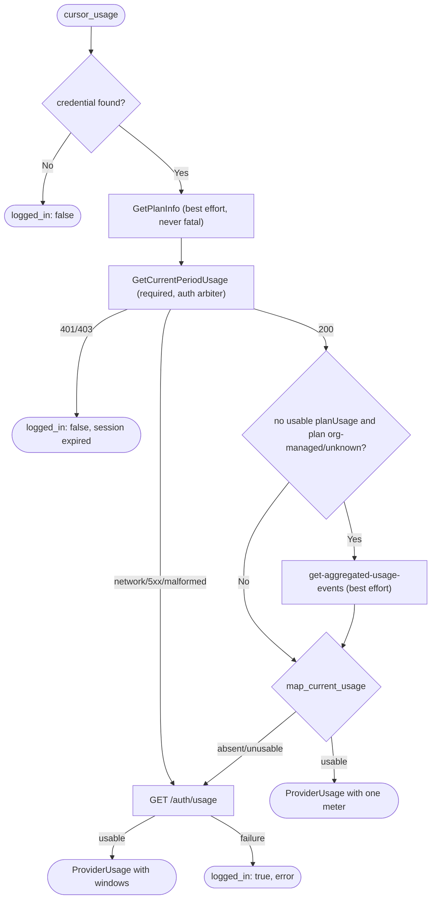

# Technical Specification: Cursor Usage Meter

Status: Implemented
Associated Issues: #1674 (parent #1670; foundation #1671)
Adapter: `src-tauri/src/services/usage/adapters/cursor.rs`

---

## 1. Problem

The original Cursor meter (`#1173`) read only the legacy
`GET https://api2.cursor.sh/auth/usage` response and expected a per-model
request limit (`gpt-4.maxRequestUsage`). Enterprise accounts can report request
totals without an individual maximum, so the panel rendered `N/A` even though
Cursor had reported real spend.

Cursor's current client obtains the plan and the billing-period usage through
its Dashboard service. This specification replaces the legacy-only probe with
that flow and keeps the legacy endpoint as a fallback.

## 2. Endpoint & Authentication

All primary calls ride the personal credential Cursor already stores locally
(`CURSOR_API_KEY`, `state.vscdb` → `cursorAuth/accessToken`, or
`~/.cursor/auth.json`) — **no Cursor admin key is used**.

| Step | Method | URL | Auth |
| --- | --- | --- | --- |
| 1. Plan | `POST` | `api2.cursor.sh/aiserver.v1.DashboardService/GetPlanInfo` | `Authorization: Bearer <token>` |
| 2. Current period | `POST` | `api2.cursor.sh/aiserver.v1.DashboardService/GetCurrentPeriodUsage` | `Authorization: Bearer <token>` |
| 3. Billing-cycle aggregate | `POST` | `cursor.com/api/dashboard/get-aggregated-usage-events` | `WorkosCursorSessionToken` cookie (+ bearer) |
| 4. Legacy fallback | `GET` | `api2.cursor.sh/auth/usage` | `Authorization: Bearer <token>` |

Steps 1–3 are Connect unary RPCs / dashboard REST calls: the Connect requests
send an empty `{}` body with `Content-Type: application/json` and
`Connect-Protocol-Version: 1`. The aggregate-events request sends
`{ "teamId": -1, "startDate": <epoch-ms>, "endDate": <epoch-ms> }`, bounded by
the billing-cycle start and *now*.

The `WorkosCursorSessionToken` cookie value is `<userId>::<token>` with **every
byte outside the RFC 3986 unreserved set percent-encoded** (so `::` becomes
`%3A%3A`). `<userId>` is the tail of the JWT `sub` claim after the last `|`.
When the token is not a decodable JWT the aggregate-events call still proceeds
with the bearer alone.

## 3. Ordering & Degradation

Rules pinned by the loopback tests:

1. **A successful current flow is authoritative.** The legacy endpoint is never
   called when the current flow produced a meter.
2. **The legacy endpoint runs only after the current flow fails or is absent.**
3. **Authentication failures are not retried against the legacy endpoint.** A
   `401`/`403` on the required period call returns `logged_in: false` with the
   `cursor-agent login` remediation, because the legacy endpoint uses the same
   credential.
4. **The optional plan probe never decides auth or routing on failure.** A
   transport error, `5xx`, shape mismatch, *or* `401/403` on `GetPlanInfo`
   yields "plan unknown" and the required period call proceeds.
5. **Temporary failures fall through.** Transport errors, `5xx`, `429` and
   shape mismatches try the legacy endpoint; when the legacy endpoint also
   fails the result is `logged_in: true` with an `error` (the UI's
   "temporarily unavailable" state).

### 3.1 Org-managed plan detection

The plan name is matched case- and whitespace-insensitively against
`enterprise` and `business` (substring). An **unknown** plan (probe failed or
empty) is treated as org-managed so a flaky probe cannot resurrect the `N/A`
bug; a *known* non-org plan (`pro`, `team`, …) keeps the legacy path.

### 3.2 Aggregate window

`get-aggregated-usage-events` is bounded by `[billingCycleStart, now]`. A
missing or zero `billingCycleStart` makes the window undefined, so the aggregate
call is skipped and the flow falls through to legacy.

## 4. Mapping to the Usage Meter Contract

**One meter per account.** The glanceable panel has no per-meter label
(`UsageAmount`) and renders identical "Amount used / Limit / Remaining" blocks,
so emitting two anonymous meters would be confusing by construction. Figures
that are not the meter are carried in `detail`.

### 4.1 Standard plans (`planUsage` present)

`planUsage.limit`, `totalSpend`, `includedSpend`, `bonusSpend`,
`remaining` and `totalPercentUsed` map to a single `UsageMeter::Metered`
`UsageAmount` in USD:

- `used` = `totalSpend` (falling back to `includedSpend`, then `limit - remaining`)
- `limit` / `remaining` = reported cents → dollars
- `usedPercent` = `totalPercentUsed` (falling back to `used / limit`)
- `resetsAt` = `billingCycleEnd`

When the plan reports only a percentage (`totalPercentUsed` without a limit)
the amount uses the `%` unit with a `100` limit, so a percent-only account is
not misread as unavailable.

`includedSpend` / `bonusSpend` and the individual/team spend limits are
surfaced in `detail` (`Included spend … · Bonus spend … · Individual cap: …
· Team pool: …`), not as additional meters.

### 4.2 Spend limits

`spendLimitUsage` reports individual and pooled (team) limits. They are never
summed or cross-wired — used and remaining are always taken from the same level
as the chosen limit:

- Only an **individual** limit is a cap. It yields `UsageMeter::Metered` using
  the individual used/remaining amounts (never the pool's).
- A **team pool alone** is not an individual cap. The meter is
  `UsageMeter::NoIndividualLimit`; the pool is reported in `detail`
  (`Team pool …`).
- The standard-plan individual cap line in `detail` uses the individual used
  amount (falling back to overall spend), never the team pool's.

### 4.3 No usable `planUsage` (Enterprise / Business / unknown plan)

When the period response has no usable `planUsage` object *and* the plan is
org-managed or unknown, the current-cycle aggregate spend from
`get-aggregated-usage-events` is the spend source. There is **no**
`spendLimitUsage` precondition:

- `totalCostCents` → the used amount (cents → dollars); the individual cap (when
  present) → the limit.
- `0` is a valid reading: it maps to `NoIndividualLimit { used: 0.0 }`, never
  to "unavailable".
- When there is no reported *and* no aggregate spend, the current flow is
  treated as absent and the legacy endpoint runs.

A known non-org plan without a usable `planUsage` object routes to the legacy
fallback (the aggregate branch is org-managed/unknown only).

### 4.4 Value hygiene

Money and percent figures are clamped to non-negative finite values before they
reach the wire, so a malformed upstream (`totalSpend: -100`, `remaining: -500`,
`totalPercentUsed: -5`) cannot render negative dollars in the panel.

## 5. Redacted Fixtures

`src-tauri/src/services/usage/adapters/fixtures/`:

| Fixture | Covers |
| --- | --- |
| `cursor-plan-info-enterprise.json` | `GetPlanInfo` plan lookup |
| `cursor-period-usage-pro.json` | Standard plan allowance |
| `cursor-period-usage-pro-strings.json` | Same shape with string-encoded numbers |
| `cursor-period-usage-enterprise-capped.json` | No `planUsage`, individual cap present |
| `cursor-period-usage-enterprise-uncapped.json` | No `planUsage`, team pool only |
| `cursor-aggregated-events-spend.json` | Current-cycle aggregate spend |
| `cursor-aggregated-events-zero.json` | Zero Enterprise spend |
| `cursor-legacy-auth-usage.json` | Legacy `/auth/usage` fallback |

An aggregate-only period (no `planUsage`, no `spendLimitUsage`) is built inline
in the tests.

## 6. Tests

- **Pure mapping** — each fixture through `map_current_usage`, asserting the
  exact `UsageMeter` state, amounts, percentages, reset timestamps and `detail`.
  Includes plan-label variants, unknown plan, negative-value clamping, the
  `includedSpend` / `limit - remaining` derivations, the string-number path, and
  the "pooled spend never appears against an individual cap" cases.
- **Loopback HTTP** — uses the shared `spawn_loopback` helper (bounded worker
  thread) and captures the full request (method, path, headers, body), proving:
  ordering (legacy skipped on success; runs *after* failure; never on `401`),
  the Connect headers/body, the aggregate `{teamId,startDate,endDate}` body and
  `WorkosCursorSessionToken` cookie, and the legacy `User-Agent`.
- **Full adapter result** — `CursorAdapter::fetch` exercised end-to-end through
  the thread-local loopback seam.

## 7. Evidence

The contract is undocumented and reverse-engineered from the Cursor client and
public third-party probes: the `GetCurrentPeriodUsage` / `GetPlanInfo` Connect
RPCs and the `get-aggregated-usage-events` request/response shape match the
payloads observed by the `robinebers/openusage`, `ClearMeasureLabs/Cursor-Usage-Status`
and `shadeov/cursor-costs-raycast` projects. Cursor may change field names or
routes without notice; per the usage module contract every shape mismatch
degrades to "usage unavailable", never a hard error.

The plan name is used for routing only and is not displayed: issue #1674's
criterion 1 ("The meter displays Cursor's reported plan") is superseded by
#1689, which removed `ProviderUsage.plan` and the plan label from the UI (the
e2e test pins that no `/Plan:/` text renders). This is tracked for maintainer
sign-off on #1674.
