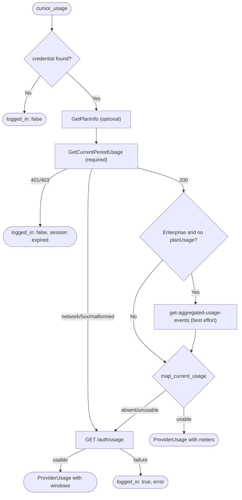

# Technical Specification: Cursor Usage Meter

Status: Implemented
Associated Issues: #1674 (parent #1670; foundation #1671)
Adapter: `src-tauri/src/services/usage/adapters/cursor.rs`

---

## 1. Problem

The original Cursor meter (`#1173`) read only the legacy
`GET https://api2.cursor.sh/auth/usage` response and expected a per-model
request limit (`gpt-4.maxRequestUsage`). Enterprise accounts can report request
totals without an individual maximum, so the panel rendered `N/A` even though
Cursor had reported real spend.

Cursor's current client obtains the plan and the billing-period usage through
its Dashboard service. This specification replaces the legacy-only probe with
that flow and keeps the legacy endpoint as a fallback.

## 2. Endpoint & Authentication

All primary calls ride the personal credential Cursor already stores locally
(`CURSOR_API_KEY`, `state.vscdb` → `cursorAuth/accessToken`, or
`~/.cursor/auth.json`) — **no Cursor admin key is used**.

| Step | Method | URL | Auth |
| --- | --- | --- | --- |
| 1. Plan | `POST` | `api2.cursor.sh/aiserver.v1.DashboardService/GetPlanInfo` | `Authorization: Bearer <token>` |
| 2. Current period | `POST` | `api2.cursor.sh/aiserver.v1.DashboardService/GetCurrentPeriodUsage` | `Authorization: Bearer <token>` |
| 3. Enterprise aggregate | `POST` | `cursor.com/api/dashboard/get-aggregated-usage-events` | `WorkosCursorSessionToken` cookie (+ bearer) |
| 4. Legacy fallback | `GET` | `api2.cursor.sh/auth/usage` | `Authorization: Bearer <token>` |

Steps 1–3 are Connect unary RPCs / dashboard REST calls: the Connect requests
send an empty `{}` body with `Content-Type: application/json` and
`Connect-Protocol-Version: 1`. The aggregate-events request sends
`{ "teamId": -1, "startDate": <epoch-ms>, "endDate": <epoch-ms> }`, bounded by
the billing-cycle start and *now*.

The `WorkosCursorSessionToken` cookie is derived from the access-token JWT:
`<userId>::<token>` URL-encoded, where `<userId>` is the tail of the JWT `sub`
claim after the last `|`. When the token is not a decodable JWT the
aggregate-events call still proceeds with the bearer alone.

## 3. Ordering & Degradation

Rules pinned by the loopback tests:

1. **A successful current flow is authoritative.** The legacy endpoint is never
   called when the current flow produced a meter.
2. **The legacy endpoint runs only after the current flow fails or is absent.**
3. **Authentication failures are not retried against the legacy endpoint.** A
   `401`/`403` on the current flow returns `logged_in: false` with the
   `cursor-agent login` remediation, because the legacy endpoint uses the same
   credential.
4. **Temporary failures fall through.** Transport errors, `5xx`, `429` and
   shape mismatches try the legacy endpoint; when the legacy endpoint also
   fails the result is `logged_in: true` with an `error` (the UI's
   "temporarily unavailable" state).

## 4. Mapping to the Usage Meter Contract

### 4.1 Standard plans (`planUsage` present)

`planUsage.limit`, `totalSpend`, `includedSpend`, `bonusSpend`,
`remaining` and `totalPercentUsed` map to a single `UsageMeter::Metered`
`UsageAmount` in USD:

- `used` = `totalSpend` (falling back to `includedSpend`, then `limit - remaining`)
- `limit` / `remaining` = reported cents → dollars
- `usedPercent` = `totalPercentUsed` (falling back to `used / limit`)
- `resetsAt` = `billingCycleEnd`

When the plan reports only a percentage (`totalPercentUsed` without a limit)
the amount uses the `%` unit with a `100` limit, so a percent-only account is
not misread as unavailable.

`includedSpend` / `bonusSpend` are surfaced in `detail` (`Included spend … ·
Bonus spend …`), not as separate meters: the glanceable panel renders one
allowance per account, and #1689 deliberately suppresses plan labels.

### 4.2 Spend limits

`spendLimitUsage` reports individual and pooled (team) limits. They are never
summed or conflated:

- **Individual cap present** → `UsageMeter::Metered` using the individual
  limit/used/remaining.
- **Only a team pool present** → the pooled limit is *not* an individual cap.
  On Enterprise this yields `UsageMeter::NoIndividualLimit`; the pool is
  reported in `detail` (`Team pool …`).
- **Neither** → `NoIndividualLimit` with the current-cycle spend and no limit.

### 4.3 Enterprise without `planUsage`

An Enterprise account whose `GetCurrentPeriodUsage` response has no usable
`planUsage` object uses the current-cycle aggregate spend from
`get-aggregated-usage-events`:

- `totalCostCents` → the used amount (cents → dollars).
- `0` is a valid reading: it maps to `NoIndividualLimit { used: 0.0 }`, never
  to "unavailable".
- When there is no reported or aggregate spend at all the current flow is
  treated as absent and the legacy endpoint runs.

Non-Enterprise plans without a usable `planUsage` object also route to the
legacy fallback (the spec's aggregate branch is Enterprise-only).

## 5. Redacted Fixtures

`src-tauri/src/services/usage/adapters/fixtures/`:

| Fixture | Covers |
| --- | --- |
| `cursor-plan-info-enterprise.json` | `GetPlanInfo` plan lookup |
| `cursor-period-usage-pro.json` | Standard plan allowance + individual cap |
| `cursor-period-usage-enterprise-capped.json` | Enterprise, individual cap present |
| `cursor-period-usage-enterprise-uncapped.json` | Enterprise, no individual cap |
| `cursor-aggregated-events-spend.json` | Current-cycle aggregate spend |
| `cursor-aggregated-events-zero.json` | Zero Enterprise spend |
| `cursor-legacy-auth-usage.json` | Legacy `/auth/usage` fallback |

## 6. Tests

- **Pure mapping** — each fixture through `map_current_usage`, asserting the
  exact `UsageMeter` state, amounts, percentages and reset timestamps.
- **Loopback HTTP** — one `tiny_http` server routes by path and records the
  order it served requests, proving (a) the legacy endpoint is skipped on a
  successful current flow, (b) it runs *after* a failed current flow, (c) a
  rejected credential never reaches it, and (d) the Enterprise aggregate-events
  call happens before legacy fallback.
- **Full adapter result** — `CursorAdapter::fetch` exercised end-to-end
  through the thread-local loopback seam.

## 7. Evidence

The contract is undocumented and reverse-engineered from the Cursor client and
public third-party probes: the `GetCurrentPeriodUsage` / `GetPlanInfo` Connect
RPCs and the `get-aggregated-usage-events` request/response shape match the
payloads observed by the `robinebers/openusage`, `ClearMeasureLabs/Cursor-Usage-Status`
and `shadeov/cursor-costs-raycast` projects. Cursor may change field names or
routes without notice; per the usage module contract every shape mismatch
degrades to "usage unavailable", never a hard error.
