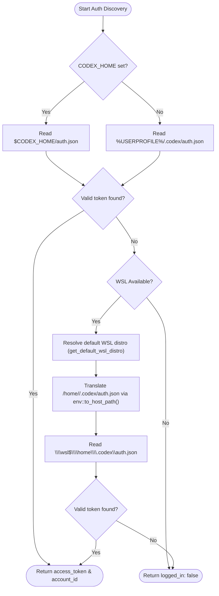

# Technical Specification: OpenAI & Codex Usage Meters

Status: Approved / Ready for Implementation  
Associated Issues: #1107, #1108, #1109, #1110, #1111, #1112  
Architecture Decision Record: [ADR-0026](../adr/0026-openai-and-codex-usage-meters.md)

---

## 1. Executive Summary & Domain Context

Buildmesh tracks and renders provider usage metrics in the **Providers** and **Usage** views across two core paradigms:
1. **Subscription Quotas (Plan Quota):** Rolling time-window usage meters (e.g. 5-hour rolling limits, weekly caps) with countdown timers to reset timestamps.
2. **Pay-As-You-Go Balances (Cash / Credits):** Wallet balances, credit remaining, and current billing month spend figures, including capped monthly spend controls.

This document specifies the end-to-end wire contract, reverse-engineered schema mappings, passive credential discovery routines, and error degradation policies for **Codex CLI** (ChatGPT plan usage, including Business and Enterprise spend controls) and **OpenAI Platform API** (organization spend). OpenAI Platform organisation spend is a separate meter from Codex ChatGPT Business/Enterprise spend.

---

## 2. Codex CLI Usage Meter

### 2.1 Endpoint & Authentication

- **Endpoint:** `GET https://chatgpt.com/backend-api/wham/usage`
- **Request Headers:**
  - `Authorization: Bearer <access_token>`
  - `ChatGPT-Account-Id: <account_id>` (optional; included if present in the auth profile)
  - `User-Agent: buildmesh/<version>`

### 2.2 Auth File Discovery & Cross-Platform Resolution

Authentication tokens are read passively from disk without modifying CLI credentials or triggering OAuth refreshes:



#### Discovery Priority Order:
1. **Windows Host Override:** `$CODEX_HOME/auth.json` (if `CODEX_HOME` environment variable is set and non-empty).
2. **Windows Host Default:** `%USERPROFILE%/.codex/auth.json` (or `%HOME%/.codex/auth.json`).
3. **WSL Fallback:**
   - Detect the default running or installed WSL distribution using `crate::env::get_default_wsl_distro()`.
   - Resolve the WSL user's home directory (e.g. `/home/<user>/.codex/auth.json`).
   - Convert path to host-accessible Windows UNC format using `crate::env::to_host_path` (`\\wsl$\<distro>\home\<user>\.codex\auth.json`).
   - Restrict resolution strictly to the default distro to avoid waking sleeping instances.

### 2.3 Auth File Deserialization Schema

The parser handles both legacy top-level tokens and nested auth token envelopes:

```rust
#[derive(Deserialize, Debug)]
pub struct CodexAuthFile {
    pub access_token: Option<String>,
    pub account_id: Option<String>,
    pub tokens: Option<CodexNestedTokens>,
}

#[derive(Deserialize, Debug)]
pub struct CodexNestedTokens {
    pub access_token: Option<String>,
    pub account_id: Option<String>,
}

impl CodexAuthFile {
    pub fn extract_credentials(&self) -> Option<(String, Option<String>)> {
        if let Some(token) = self.access_token.as_ref().filter(|t| !t.is_empty()) {
            return Some((token.clone(), self.account_id.clone()));
        }
        if let Some(nested) = &self.tokens {
            if let Some(token) = nested.access_token.as_ref().filter(|t| !t.is_empty()) {
                return Some((token.clone(), nested.account_id.clone().or_else(|| self.account_id.clone())));
            }
        }
        None
    }
}
```

### 2.4 Upstream API Payload Schema

Consumer rolling-window replies (Plus, Pro, and similar) typically look like:

```json
{
  "plan_type": "plus",
  "rate_limit": {
    "primary_window": {
      "used_percent": 18.5,
      "limit_window_seconds": 18000,
      "reset_at": 1755288000
    },
    "secondary_window": {
      "used_percent": 42.0,
      "limit_window_seconds": 604800,
      "reset_at": 1755892800
    }
  },
  "credits": null,
  "spend_control": null,
  "additional_rate_limits": null
}
```

Business and Enterprise replies may set `rate_limit` to `null` and instead report credits and an individual spend control. Amounts are often decimal strings:

```json
{
  "plan_type": "enterprise",
  "rate_limit": null,
  "credits": {
    "has_credits": true,
    "unlimited": false,
    "balance": "17000.50"
  },
  "spend_control": {
    "reached": false,
    "individual_limit": {
      "limit": "25000",
      "used": "8000",
      "remaining": "17000",
      "used_percent": 32,
      "reset_at": 1778137680
    }
  },
  "additional_rate_limits": [
    {
      "limit_name": "codex_other",
      "metered_feature": "codex_other",
      "rate_limit": {
        "primary_window": {
          "used_percent": 30.0,
          "limit_window_seconds": 3600,
          "reset_at": 1755288000
        }
      }
    }
  ]
}
```

A mixed reply may include both rolling windows and spend/credit fields. `plan_type` is an opaque provider label; unknown names must not fail the parse. Nested `rate_limit.additional_rate_limits` window objects remain accepted for older fixtures.

### 2.5 Mapping to Buildmesh Wire Contract (`ProviderUsage`)

- **Plan:** `plan_type` maps to `ProviderUsage.plan` verbatim when non-empty.
- **Window Mapping:**
  - `rate_limit.primary_window` / `secondary_window`: Mapped to `UsageWindow`. Dynamic label derived from `limit_window_seconds`:
    - `18000` seconds (5 hours) → Label `"5-hour"`.
    - `604800` seconds (7 days) → Label `"Weekly"`.
    - Other durations → Formatted dynamically (e.g. `"{N}h"`, `"{N}d"`).
  - Top-level `additional_rate_limits` named buckets append their windows, labelled with `limit_name` plus the duration.
  - `used_percent`: Kept as consumption percentage (`0.0` to `100.0`) in `UsageWindow.used_percent`.
  - `reset_at`: Converted from Unix epoch integer seconds to RFC3339 string:
    `chrono::DateTime::from_timestamp(reset_at, 0).map(|dt| dt.to_rfc3339())`.
  - `rate_limit: null` (or a missing object) is valid. It is not a shape error.
- **Credits:** `credits.unlimited` maps to `UsageMeter::Unlimited`. A numeric `credits.balance` is retained as `BillingBalance.remaining` with currency `"credits"`.
- **Spend control:** `spend_control.individual_limit` maps to `UsageMeter::Metered` (or `NoIndividualLimit` when a used amount is present without a limit), carrying used, optional limit/remaining, percentage, unit `"credits"`, and reset.
- **Detail:** When quota windows exist, populated with remaining-percentage phrasing from the highest-used window. Spend-only replies do not invent a "no rate-limit windows" error when credits or spend meters are present.

---

## 3. OpenAI Platform API Usage & Costs

### 3.1 Endpoint & Scopes

- **Endpoint:** `GET https://api.openai.com/v1/organization/costs`
- **Query Parameters:**
  - `start_time`: Unix epoch timestamp for start of current UTC calendar month.
  - `bucket_width`: `"1d"` (daily aggregation).
- **Authentication:** `Authorization: Bearer <api_key>`

### 3.2 Key Type Resolution & Degradation Matrix

| Key Type | Pattern | `/v1/organization/costs` Response | Resulting `ProviderUsage` State |
|---|---|---|---|
| **Organization Admin Key** | `sk-admin-...` | `200 OK` with cost buckets | `logged_in: true`<br>`balance: Some(BillingBalance { remaining: 0.0, monthly_spend: Some(spend), currency: "USD" })`<br>`error: None`<br>`detail: None` |
| **Standard Project Key** | `sk-proj-...` | `401 Unauthorized` / `403 Forbidden` | `logged_in: true`<br>`balance: None`<br>`error: None`<br>`detail: Some("Monthly spend tracking requires an Organization Admin API Key (sk-admin-...)")` |
| **Invalid / Revoked Key** | Any | `401 Unauthorized` on inference check | `logged_in: false`<br>`balance: None`<br>`error: Some("Invalid API key")`<br>`detail: None` |

---

## 4. TypeScript & Rust Wire Types

### 4.1 Rust Structs (`src-tauri/src/services/usage.rs`)

```rust
#[derive(Debug, Clone, Serialize, Deserialize, ts_rs::TS)]
#[ts(export, export_to = "UsageWindow.ts")]
pub struct UsageWindow {
    pub label: String,
    #[serde(rename = "usedPercent")]
    #[ts(rename = "usedPercent")]
    pub used_percent: Option<f64>,
    #[serde(rename = "resetsAt")]
    #[ts(rename = "resetsAt")]
    pub resets_at: Option<String>,
}

#[derive(Debug, Clone, Serialize, Deserialize, ts_rs::TS)]
#[ts(export, export_to = "BillingBalance.ts")]
pub struct BillingBalance {
    pub remaining: f64,
    #[serde(rename = "monthlySpend")]
    #[ts(rename = "monthlySpend")]
    pub monthly_spend: Option<f64>,
    pub currency: String,
}

#[derive(Debug, Clone, Serialize, Deserialize, ts_rs::TS)]
#[ts(export, export_to = "ProviderUsage.ts")]
pub struct ProviderUsage {
    pub provider: String,
    #[serde(rename = "loggedIn")]
    #[ts(rename = "loggedIn")]
    pub logged_in: bool,
    pub windows: Vec<UsageWindow>,
    #[serde(default)]
    pub balance: Option<BillingBalance>,
    pub detail: Option<String>,
    pub error: Option<String>,
}
```

### 4.2 TypeScript DTO Interface (`src/types/generated/`)

```typescript
export interface UsageWindow {
  label: string;
  usedPercent: number | null;
  resetsAt: string | null;
}

export interface BillingBalance {
  remaining: number;
  monthlySpend: number | null;
  currency: string;
}

export interface ProviderUsage {
  provider: string;
  loggedIn: boolean;
  windows: UsageWindow[];
  balance: BillingBalance | null;
  detail: string | null;
  error: string | null;
}
```

---

## 5. Error Handling & Invariant Rules

1. **Passive Read-Only Invariant:** Buildmesh must never execute OAuth token refresh requests or modify `~/.codex/auth.json` on disk.
2. **Normalization Invariant:** `used_percent` is always stored as 0.0 to 100.0 consumption. Remaining percentage calculation is deferred to presentation or formatted into `detail`.
3. **Degradation Invariant:** Lack of organization admin permissions on OpenAI project keys must never fail agent node execution or show false "logged-out" alerts.
4. **Nullable Codex `rate_limit`:** A ChatGPT Business or Enterprise body with `rate_limit: null` is a valid spend or credit snapshot, not a malformed payload. HTTP `401`/`403` remain authentication errors; `429` and network failures remain temporary availability errors.

---

## 6. Implementation Checklist

- [x] Reverse-engineer Codex CLI endpoint schema & headers (#1108).
- [x] Verify OpenAI Platform cost endpoints & project key degradation (#1109).
- [x] Specify cross-platform auth file discovery across Windows host and WSL (#1110).
- [x] Standardize wire contract and DTO mapping (#1111).
- [x] Lock technical specification and ADR document (#1112).
- [ ] Implement `codex_usage()` and `openai_usage()` in `src-tauri/src/services/usage.rs`.
- [ ] Add unit and mock integration tests in `src-tauri/src/services/usage.rs`.
